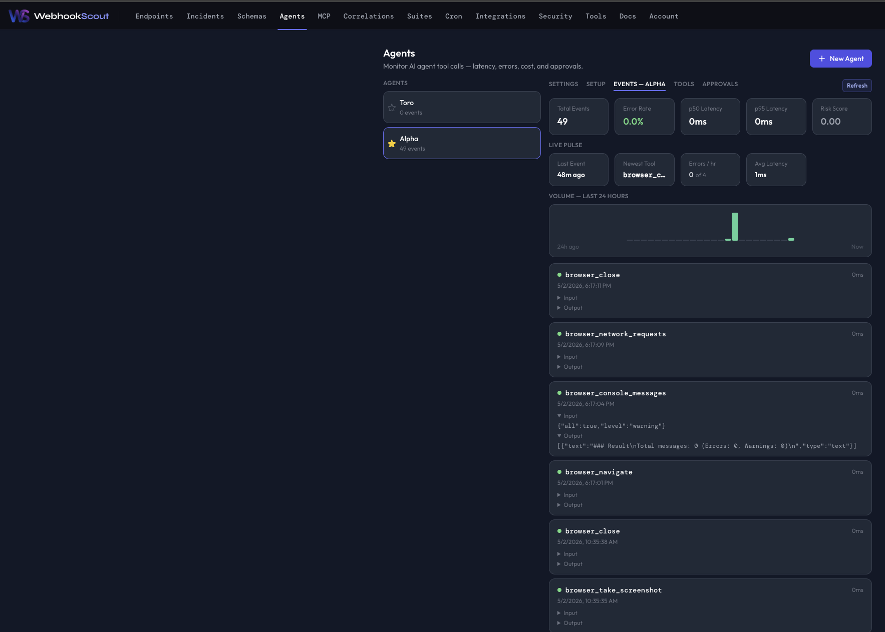
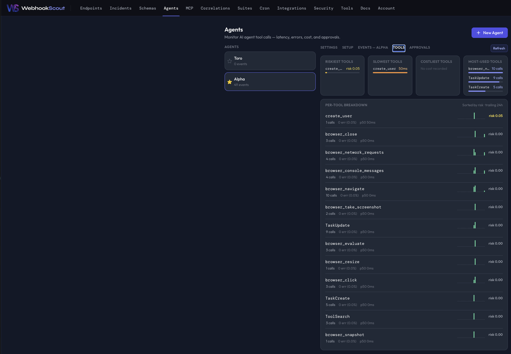
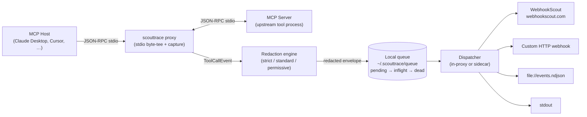

# ScoutTrace

A local, open-source CLI and MCP proxy that makes LLM tool-call observability trivial.

ScoutTrace sits between an MCP host (Claude Code, Codex, OpenClaw, Hermes, Cursor, Claude Desktop, or any other MCP-capable client) and the MCP servers it spawns. It byte-tees the JSON-RPC traffic so the host and server see exactly the bytes they would have seen without ScoutTrace, while a parallel capture pipeline builds a structured `ToolCallEvent` for every `tools/call` round-trip. Each event records *what* tool was invoked, *which* server handled it, *who* answered (success/error), and *how long* it took — never the raw conversation, and never anything that hasn't passed through redaction.

Captured events are written to a local on-disk queue, then dispatched to **any HTTP endpoint you configure**. The default destination is [WebhookScout](https://www.webhookscout.com), but ScoutTrace is destination-agnostic — point it at your own webhook, an internal sink, a local file, or `stdout`.

### What ScoutTrace gives you

- **Drop-in MCP proxy.** For built-in supported hosts, `scouttrace hosts patch` rewrites the MCP config so each server runs under `scouttrace proxy -- <upstream>`. For other MCP clients, manually configure the same proxy wrapper. Hosts and servers do not need to know ScoutTrace exists.
- **Structured `ToolCallEvent` envelopes.** Stable schema covering session, host, server, tool, request/response, timing, and the exact redaction policy hash applied.
- **Privacy-first redaction.** A `strict | standard | permissive` profile strips well-known secret patterns and PII, normalizes paths, and truncates oversized payloads *before* anything leaves the local process. Capture-level deny rules can drop fields entirely so they never enter the envelope.
- **Durable local queue.** A simple file-system queue (`pending/` → `inflight/` → `dead/`) survives crashes and restarts. The dispatcher claims rows atomically and applies exponential backoff with jitter on transient failures.
- **Pluggable destinations.** WebhookScout, generic HTTP webhook, NDJSON `file://...`, or `stdout`. Network destinations require explicit first-send approval.
- **Live LLM price lookup.** Claude Code `llm_turn` events use real model pricing from PricePerToken's free MCP endpoint when available (`src: pricepertoken`), including cache-read/cache-write rates for Anthropic usage metadata. If the lookup is offline or unknown, ScoutTrace falls back to the built-in static estimate without blocking capture.
- **Auditable, reversible host changes.** Every host-config patch is backed up; `scouttrace undo` restores the most recent backup. Setup and patching flows expose dry-run or rollback paths so you can inspect changes before trusting them.

### Claude Code integration in one command

ScoutTrace can start capturing real Claude Code tool activity without complicated setup — no proxy wiring, no MCP host patching. Run a single command from your Claude Code project directory:

```sh
scouttrace claude-hook install --scope local --project-dir "$PWD" --destination default
```

Then use Claude Code normally. Tool events appear in your WebhookScout **Agents** view as they happen.





### How it works



1. **Host patching.** `scouttrace hosts patch --host <id>` edits the host's MCP config (e.g. `claude_desktop_config.json`) so each registered MCP server is wrapped by `scouttrace proxy --server-name <name> -- <original-command>`. The original entry is preserved inside a marked block, and the prior file is copied to `~/.scouttrace/backups/<host>/...` so `scouttrace undo` can roll it back.
2. **Proxy + capture.** When the host launches a server, it actually launches `scouttrace proxy`. The proxy spawns the real upstream and byte-tees stdin/stdout in both directions — a JSON-RPC framer reads a parallel copy and emits a `ToolCallEvent` for each matched `tools/call` request/response pair.
3. **Redaction.** Each event is fed through the configured redaction policy *before it ever leaves the proxy process*. The resulting envelope records `redaction.policy_name` and `redaction.policy_hash` so consumers can verify what ran. Capture-level deny rules can prevent specific server/tool fields from being captured at all, providing a backstop independent of the redaction rules.
4. **Local queue.** Redacted envelopes are appended to `~/.scouttrace/queue/pending/`. The on-disk queue stores one compressed record per event; the dispatcher renames rows into `inflight/` atomically before delivery and into `dead/` after exhausting retries.
5. **Dispatch.** A dispatcher drains the queue and POSTs envelopes to each configured destination. It runs either in-process inside the proxy (for short-lived hosts) or as a long-running sidecar (`scouttrace start`). Network destinations are gated by first-send approval (`scouttrace destination approve …`) — until you explicitly approve, ScoutTrace will refuse to send to that host.
6. **Destinations.** ScoutTrace ships with four:
   - **`webhookscout`** — adapter for [WebhookScout](https://www.webhookscout.com). Tokens are referenced as `env://NAME`, `keychain://...`, or `encfile://...`, never written to config in plaintext. On macOS, pasted WebhookScout API keys are stored in Keychain automatically during `scouttrace init`.
   - **`http`** — generic webhook; you supply the URL and an auth-header reference.
   - **`file`** — append redacted envelopes to a local NDJSON file (`file:///path/events.ndjson`).
   - **`stdout`** — print envelopes to stdout. Useful for `--dry-run`-style flows and CI.

> **Status:** Active open-source CLI. ScoutTrace is installable from the Applexica Homebrew tap; signed standalone release binaries are still pending.

## Installation

### Quick install

```sh
brew tap Applexica/tap
brew install scouttrace
scouttrace version
```

The recommended macOS/Linux install path is the Applexica Homebrew tap. Source installation remains available for development and for platforms where Homebrew is not preferred.

### Homebrew tap (macOS and Linux)

```sh
brew tap Applexica/tap
brew install scouttrace
scouttrace version
```

To upgrade later:

```sh
brew update
brew upgrade scouttrace
```

### Source install

The commands below build the `scouttrace` binary locally from this repository and put it on your `PATH`.

### Prerequisites

- Git
- Go 1.22 or newer
- A terminal/shell for your platform

Verify Go is available:

```sh
go version
```

#### macOS

Install prerequisites with Homebrew if needed:

```sh
brew install git go
```

Build and install ScoutTrace:

```sh
git clone https://github.com/Applexica/ScoutTrace.git
cd ScoutTrace
go test ./...
go build -o scouttrace ./cmd/scouttrace
mkdir -p "$HOME/.local/bin"
mv scouttrace "$HOME/.local/bin/scouttrace"
```

Add `~/.local/bin` to your shell path if it is not already there:

```sh
echo 'export PATH="$HOME/.local/bin:$PATH"' >> ~/.zshrc
source ~/.zshrc
```

Verify installation:

```sh
scouttrace version
scouttrace --help
```

#### Linux

Install prerequisites. Debian/Ubuntu:

```sh
sudo apt-get update
sudo apt-get install -y git golang-go
```

Fedora/RHEL:

```sh
sudo dnf install -y git golang
```

Arch Linux:

```sh
sudo pacman -S --needed git go
```

Build and install ScoutTrace:

```sh
git clone https://github.com/Applexica/ScoutTrace.git
cd ScoutTrace
go test ./...
go build -o scouttrace ./cmd/scouttrace
mkdir -p "$HOME/.local/bin"
mv scouttrace "$HOME/.local/bin/scouttrace"
```

Add `~/.local/bin` to your shell path if needed:

```sh
echo 'export PATH="$HOME/.local/bin:$PATH"' >> ~/.bashrc
source ~/.bashrc
```

Verify installation:

```sh
scouttrace version
scouttrace --help
```

#### Windows

Install prerequisites:

1. Install Git for Windows: <https://git-scm.com/download/win>
2. Install Go 1.22 or newer: <https://go.dev/dl/>
3. Open PowerShell and verify both are available:

```powershell
git --version
go version
```

Build ScoutTrace:

```powershell
git clone https://github.com/Applexica/ScoutTrace.git
cd ScoutTrace
go test ./...
go build -o scouttrace.exe ./cmd/scouttrace
```

Install it into a user-local bin directory:

```powershell
New-Item -ItemType Directory -Force "$env:USERPROFILE\bin" | Out-Null
Move-Item .\scouttrace.exe "$env:USERPROFILE\bin\scouttrace.exe" -Force
```

Add that directory to your user `PATH` for future shells:

```powershell
$UserPath = [Environment]::GetEnvironmentVariable("Path", "User")
$Bin = "$env:USERPROFILE\bin"
if ($UserPath -notlike "*$Bin*") {
  [Environment]::SetEnvironmentVariable("Path", "$UserPath;$Bin", "User")
}
```

Close and reopen PowerShell, then verify installation:

```powershell
scouttrace version
scouttrace --help
```

#### Build without installing

If you only want to try ScoutTrace from a checkout:

```sh
go run ./cmd/scouttrace --help
go run ./cmd/scouttrace version
```

On Windows PowerShell, use the same commands.

### First setup after installation

For a safe local-only setup that sends captured events to stdout instead of the network:

```sh
scouttrace init --hosts none --destination stdout --yes
scouttrace doctor
```

For WebhookScout, use a WebhookScout API key plus the agent ID shown/created in the WebhookScout portal:

```sh
export SCOUTTRACE_WEBHOOKSCOUT_API_KEY='***'
scouttrace init \
  --destination webhookscout \
  --auth-header-ref env://SCOUTTRACE_WEBHOOKSCOUT_API_KEY \
  --agent-id <webhookscout-agent-id> \
  --yes
scouttrace doctor
```

> Do not paste API keys into MCP host config files. ScoutTrace config stores credential references such as `env://...`, `keychain://...`, or `encfile://...`, not raw secrets. In the interactive wizard you may paste the WebhookScout API key at the credential prompt; ScoutTrace stores it securely and writes only a credential reference.


### Generate a WebhookScout setup command from the Agent UI

The safest way to configure ScoutTrace for WebhookScout is to let WebhookScout generate the command for the exact agent and API you want to use.

1. Open [WebhookScout](https://www.webhookscout.com) and go to **Agents**.
2. Select or create the agent that should receive ScoutTrace telemetry.
3. Open the agent's **ScoutTrace Config** tab.
4. In **Configure ScoutTrace**, choose:
   - **Harness** — for example `Claude Code`, `Codex`, `Hermes`, or `OpenClaw`. Additional harnesses, including other ScoutTrace-supported hosts such as Cursor, can be added to the WebhookScout dropdown over time.
   - **Existing API** — the WebhookScout API/credential/destination ScoutTrace should use for delivery.
   - **Tool-call validation** — enable this only when you want ScoutTrace to validate protected tool calls through WebhookScout approval policies.
   - Optional home/credential/patch options when you want isolated per-harness config.
5. Copy the generated terminal command block and run it on the machine where the harness runs.
6. Run the generated `scouttrace doctor` command, then trigger one tool call from the harness.
7. Refresh the WebhookScout **ScoutTrace Config** tab to confirm the latest synced ScoutTrace configuration shows the selected harness, API, and validation state.

WebhookScout generates commands with the selected agent ID and API ID already filled in. It should not display raw API keys in the command. If you choose environment-variable credential storage, the command uses a placeholder such as:

```sh
export SCOUTTRACE_WEBHOOKSCOUT_API_KEY='<paste API key here>'
```

Example generated command block for a Codex setup with isolated ScoutTrace home:

```sh
export SCOUTTRACE_WEBHOOKSCOUT_API_KEY='<paste API key here>'

scouttrace --home ~/.scouttrace-codex init \
  --destination webhookscout \
  --webhookscout-api https://api.webhookscout.com/api \
  --webhookscout-api-id api_123 \
  --agent-id agent_123 \
  --auth-header-ref env://SCOUTTRACE_WEBHOOKSCOUT_API_KEY \
  --hosts codex \
  --tool-call-validation=true \
  --yes

scouttrace --home ~/.scouttrace-codex hosts patch --host codex
scouttrace --home ~/.scouttrace-codex destination approve default
scouttrace --home ~/.scouttrace-codex doctor
```

For Claude Code, WebhookScout may generate a `scouttrace claude-hook install ...` command instead of, or in addition to, host patching so built-in/plugin tool activity can be captured. For Codex, Hermes, and OpenClaw, the generated command normally uses the corresponding ScoutTrace host patcher.

> Tool-call validation is effective only when the selected ScoutTrace destination is `webhookscout` **and** the generated command enables `--tool-call-validation=true`. If either condition is false, ScoutTrace continues capturing telemetry but does not call WebhookScout for approval validation.

### Updating ScoutTrace

Updating has two parts: check what you have versus what is available, then upgrade by the same path you originally installed.

#### Check the installed version

```sh
scouttrace version            # human-readable, e.g. 0.1.0
scouttrace version --json     # machine-readable for scripts
```

After upgrading, re-run `scouttrace version` and `scouttrace doctor` to confirm the new binary is on `PATH` and the config still validates:

```sh
scouttrace version
scouttrace doctor
```

#### Check the latest available version (Homebrew)

`brew info` shows the version in the tap alongside the version Homebrew has installed locally. Refresh the tap first.

```sh
brew update
brew info scouttrace          # shows tap (latest) vs installed
brew outdated scouttrace      # exits non-zero if an upgrade is available
```

#### Upgrade via Homebrew

```sh
brew update
brew upgrade scouttrace
scouttrace version
scouttrace doctor
```

If you tapped from a fork or alternate tap and want to confirm where the formula came from:

```sh
brew tap                      # lists installed taps
brew info scouttrace          # shows the tap path under "From:"
```

#### Upgrade from a source build

For installs that came from `go build` (no Homebrew involvement), pull the latest source and rebuild. The commands below assume the layout used in the source-install steps above.

```sh
cd ScoutTrace
git fetch --tags
git checkout main             # or a release tag, e.g. git checkout vX.Y.Z
git pull --ff-only
go test ./...
go build -o scouttrace ./cmd/scouttrace
mv scouttrace "$HOME/.local/bin/scouttrace"
scouttrace version
scouttrace doctor
```

To target a specific released version instead of `main`:

```sh
cd ScoutTrace
git fetch --tags
git checkout vX.Y.Z           # replace with a real tag from `git tag --list`
go build -o scouttrace ./cmd/scouttrace
mv scouttrace "$HOME/.local/bin/scouttrace"
scouttrace version
```

On Windows PowerShell, rebuild `scouttrace.exe` and move it back to `%USERPROFILE%\bin`:

```powershell
cd ScoutTrace
git pull
go build -o scouttrace.exe ./cmd/scouttrace
Move-Item .\scouttrace.exe "$env:USERPROFILE\bin\scouttrace.exe" -Force
scouttrace version
```

> **Compare installed vs available at a glance.** For Homebrew installs, run `scouttrace version` and `brew info scouttrace` side by side. For source installs, run `scouttrace version`, `git -C ScoutTrace tag --points-at HEAD`, and `git -C ScoutTrace log -1 --oneline` so you know exactly which checkout produced your binary.

### Future package managers

The following non-Homebrew install paths are planned but not yet published:

```sh
winget install WebhookScout.ScoutTrace
scoop install scouttrace
```

Until those packages exist, use Homebrew or the source installation steps above.

## Quick start

```sh
scouttrace init --hosts none --destination stdout --yes
scouttrace doctor
```

`scouttrace init` creates `~/.scouttrace/config.yaml`. Built-in host patching can then be enabled with `scouttrace hosts patch` for supported MCP hosts: `claude-desktop`, `claude-code`, `cursor`, `codex`, `opencode`, `openclaw`, and `hermes`. JSON hosts use inline `_scouttrace` markers; Codex TOML and Hermes YAML configs use external backup metadata under `~/.scouttrace/backups/<host>/markers.json` so secrets in env blocks are not duplicated. For Windsurf, Continue, or other MCP clients without a built-in host ID, use the manual `scouttrace proxy -- ...` wrapper examples below. You can preview what will be captured before any network egress with `scouttrace preview --json`.

## How to use ScoutTrace

This section is a hands-on tour of every command in the ScoutTrace CLI. Run `scouttrace <command> --help` for a flag reference; the examples below cover the realistic workflows.

### Global flags

These work in front of any subcommand:

```sh
scouttrace --home /tmp/scout-isolated --config /tmp/scout-isolated/config.yaml status
scouttrace --json status
scouttrace -v hosts list      # -v = verbose, -vv = more verbose
```

`SCOUTTRACE_HOME` and `SCOUTTRACE_CONFIG` work as environment-variable equivalents of `--home` / `--config`.

### WebhookScout examples for Claude Code, Codex, OpenClaw, Hermes, and Cursor

The examples below show the same ScoutTrace command family for five common AI coding/agent environments. WebhookScout-specific examples use the `webhookscout` destination and store credentials through environment-variable or keychain-style references. Replace `[REDACTED]` with your real WebhookScout API key only in your local shell, never in committed files, and replace `<webhookscout-agent-id>` with the agent ID from the WebhookScout portal.

> **Support note:** ScoutTrace now has built-in host patchers for `claude-code`, `claude-desktop`, `cursor`, `codex`, `opencode`, `openclaw`, and `hermes`. Use `scouttrace hosts patch --host <id>` to register natively. Manual `scouttrace proxy -- ...` wrapping is still available for unsupported clients or one-off server commands.

Shared variables used by several examples:

```sh
export SCOUTTRACE_WEBHOOKSCOUT_API_KEY='***'
export WEBHOOKSCOUT_AGENT_ID='<webhookscout-agent-id>'
```

#### Choosing a ScoutTrace home: shared global vs isolated per-host

ScoutTrace stores everything (config, queue, backups, audit log, credentials) under a *home* directory selected by `--home` (or `SCOUTTRACE_HOME`). You have two practical options. Pick one and reuse it consistently.

**Shared global home (`~/.scouttrace`)**

Use one home for every MCP host on the machine. Same destination, same redaction policy, same queue, same approval state. Easiest to operate; one `scouttrace doctor` covers everything.

```sh
# One-time setup, shared by Claude Code, Claude Desktop, Cursor, Codex, OpenClaw, etc.
scouttrace init \
  --destination webhookscout \
  --auth-header-ref env://SCOUTTRACE_WEBHOOKSCOUT_API_KEY \
  --agent-id "$WEBHOOKSCOUT_AGENT_ID" \
  --hosts none --yes

scouttrace destination approve default
scouttrace doctor

# Every host then wraps its MCP servers with the same proxy/home.
scouttrace proxy --server-name <server> -- <original-command>
```

**Isolated per-host homes (`~/.scouttrace-<host>`)**

Use one home per MCP host when you want them logically separated — e.g. different destinations, different redaction profiles, different agent IDs, or simply to keep queues from one host out of another. You will run `init`, `approve`, `doctor`, and `start` against each home.

```sh
# Codex profile, fully separate from Claude Code's defaults.
scouttrace --home ~/.scouttrace-codex init \
  --destination webhookscout \
  --auth-header-ref env://SCOUTTRACE_WEBHOOKSCOUT_API_KEY \
  --agent-id "$WEBHOOKSCOUT_AGENT_ID" \
  --hosts none --yes

scouttrace --home ~/.scouttrace-codex destination approve default
scouttrace --home ~/.scouttrace-codex doctor

# Codex's MCP servers must use the same --home in their proxy wrapper.
scouttrace --home ~/.scouttrace-codex proxy --server-name <server> -- <original-command>
```

> **Heads-up:** the `--home` you use when starting the proxy must match the one you used for `init`. Otherwise the proxy reads a different (or empty) config and will not deliver to the destination you expect.

You can also point at a temporary home for safe experiments without disturbing real installs:

```sh
scouttrace --home /tmp/scout-isolated init --hosts none --destination stdout --yes
scouttrace --home /tmp/scout-isolated preview --json \
  | scouttrace --home /tmp/scout-isolated queue inject --destination default
scouttrace --home /tmp/scout-isolated queue flush
```

#### Proxy-wrap examples for Claude Desktop and a generic MCP host

The five environments covered later (Claude Code, Codex, OpenClaw, Hermes, Cursor) all reduce to the same pattern: launch the upstream MCP server under `scouttrace proxy --server-name <name> -- <original-command>`. Two more common cases:

**Claude Desktop (built-in patcher; shared global home)**

Claude Desktop has a JSON config (`claude_desktop_config.json`) that ScoutTrace can patch directly.

```sh
# One-time, shared global home.
scouttrace init \
  --destination webhookscout \
  --auth-header-ref env://SCOUTTRACE_WEBHOOKSCOUT_API_KEY \
  --agent-id "$WEBHOOKSCOUT_AGENT_ID" \
  --hosts claude-desktop --yes

scouttrace destination approve default

# Inspect what was patched, and roll back if needed.
scouttrace hosts list --json
scouttrace undo --host claude-desktop          # restores from ~/.scouttrace/backups
```

**Claude Desktop (isolated home)**

```sh
scouttrace --home ~/.scouttrace-desktop init \
  --destination webhookscout \
  --auth-header-ref env://SCOUTTRACE_WEBHOOKSCOUT_API_KEY \
  --agent-id "$WEBHOOKSCOUT_AGENT_ID" \
  --hosts claude-desktop --yes

scouttrace --home ~/.scouttrace-desktop destination approve default
scouttrace --home ~/.scouttrace-desktop hosts list --json
```

After patching Claude Desktop, fully quit and relaunch it (the menu bar icon must restart) so it re-reads `claude_desktop_config.json`.

**Generic / unsupported MCP host (no built-in patcher)**

For any MCP-capable client without a ScoutTrace patcher (Windsurf, Continue, your own host, an in-house agent), edit the host's MCP server definition by hand. Replace each entry's command with the same command wrapped by `scouttrace proxy`. Pattern:

```jsonc
// Before
{
  "mcpServers": {
    "github": {
      "command": "npx",
      "args": ["-y", "@modelcontextprotocol/server-github"]
    }
  }
}

// After (shared global home)
{
  "mcpServers": {
    "github": {
      "command": "scouttrace",
      "args": ["proxy", "--server-name", "github", "--",
               "npx", "-y", "@modelcontextprotocol/server-github"]
    }
  }
}

// After (isolated home for this host)
{
  "mcpServers": {
    "github": {
      "command": "scouttrace",
      "args": ["--home", "/Users/you/.scouttrace-myhost",
               "proxy", "--server-name", "github", "--",
               "npx", "-y", "@modelcontextprotocol/server-github"]
    }
  }
}
```

Quick smoke test of the wrapped command from a shell, before pointing the host at it:

```sh
# Shared global home.
scouttrace proxy --server-name github -- npx -y @modelcontextprotocol/server-github

# Isolated home.
scouttrace --home ~/.scouttrace-myhost proxy --server-name github \
  -- npx -y @modelcontextprotocol/server-github
```

For a host that exposes its own SDK or spawns Python/Node agents directly (no MCP server), use `scouttrace run` to inject ScoutTrace env vars instead:

```sh
scouttrace run -- python ./agents/my_agent.py
scouttrace --home ~/.scouttrace-myhost run -- node ./agents/my-agent.mjs
```

#### `scouttrace init` with WebhookScout

Create the local ScoutTrace config and point it at WebhookScout. Use either a WebhookScout API key plus agent ID, or a short-lived setup token if your WebhookScout portal exposes one. In the interactive wizard, the credential prompt accepts either a credential reference like `env://SCOUTTRACE_WEBHOOKSCOUT_API_KEY` or the raw WebhookScout API key; raw keys are stored in Keychain/encfile and are not written to config.

```sh
# Claude Code: built-in host id.
scouttrace init \
  --destination webhookscout \
  --auth-header-ref env://SCOUTTRACE_WEBHOOKSCOUT_API_KEY \
  --agent-id "$WEBHOOKSCOUT_AGENT_ID" \
  --hosts claude-code \
  --yes

# Codex: initialize WebhookScout destination, then wrap Codex MCP servers manually with `proxy`.
scouttrace --home ~/.scouttrace-codex init \
  --destination webhookscout \
  --auth-header-ref env://SCOUTTRACE_WEBHOOKSCOUT_API_KEY \
  --agent-id "$WEBHOOKSCOUT_AGENT_ID" \
  --hosts none \
  --yes

# OpenClaw: initialize a separate profile for OpenClaw/OpenCode-style MCP servers.
scouttrace --home ~/.scouttrace-openclaw init \
  --destination webhookscout \
  --auth-header-ref env://SCOUTTRACE_WEBHOOKSCOUT_API_KEY \
  --agent-id "$WEBHOOKSCOUT_AGENT_ID" \
  --hosts none \
  --yes

# Hermes: initialize a Hermes-specific ScoutTrace home.
scouttrace --home ~/.scouttrace-hermes init \
  --destination webhookscout \
  --auth-header-ref env://SCOUTTRACE_WEBHOOKSCOUT_API_KEY \
  --agent-id "$WEBHOOKSCOUT_AGENT_ID" \
  --hosts none \
  --yes

# Cursor: built-in host id.
scouttrace init \
  --destination webhookscout \
  --auth-header-ref env://SCOUTTRACE_WEBHOOKSCOUT_API_KEY \
  --agent-id "$WEBHOOKSCOUT_AGENT_ID" \
  --hosts cursor \
  --yes
```


#### Claude Code hooks for built-in and plugin tools

`scouttrace proxy` captures MCP servers that are launched through a `scouttrace proxy -- ...` wrapper. Claude Code also has built-in tools and plugin-provided MCP tools, such as `plugin:playwright:playwright`, that can be available in `/mcp` without launching through a user-editable MCP server command. Those calls will not pass through the proxy. Use the Claude Code PostToolUse hook below to capture them too.

##### Local vs global install: pick a Claude Code settings scope

Claude Code reads hook configuration from three different settings files. ScoutTrace's `claude-hook install --scope` flag picks which file to write into. Choose by **who** should see the hook and **how it should be persisted**:

| `--scope`   | Settings file written                          | Visibility / persistence                                                | When to use                                                              |
|-------------|------------------------------------------------|-------------------------------------------------------------------------|--------------------------------------------------------------------------|
| `local`     | `<project>/.claude/settings.local.json`        | Personal to you in this project; usually gitignored.                    | Install on your own machine without affecting teammates or other repos.  |
| `project`   | `<project>/.claude/settings.json`              | Committed to the repo; everyone on the project picks it up.             | Team-wide capture for a single repo (review the diff before committing). |
| `user`      | `~/.claude/settings.json`                      | Per-user global; applies across every Claude Code project you open.     | "Capture every Claude Code session everywhere on this machine."          |

Install the hook from the same project directory you open in Claude Code (for `local` and `project`):

```sh
# Local install: personal, project-scoped, gitignored — writes .claude/settings.local.json.
scouttrace claude-hook install --scope local --project-dir "$PWD" --destination default

# Project install: team-shared via git — writes .claude/settings.json.
scouttrace claude-hook install --scope project --project-dir "$PWD" --destination default

# Global install: applies to every Claude Code project — writes ~/.claude/settings.json.
scouttrace claude-hook install --scope user --destination default
```

After installing, restart Claude Code (or reopen the project) so the new hook settings are picked up. To preview which JSON block ScoutTrace would write before touching disk:

```sh
scouttrace claude-hook snippet --destination default
```

To uninstall, edit the relevant settings file and remove the `PostToolUse` entry that runs `scouttrace ... claude-hook post-tool-use`. There is no `claude-hook uninstall` subcommand today.

The installed hook runs after every Claude Code tool call:

```sh
scouttrace --home ~/.scouttrace claude-hook post-tool-use --destination default --flush
```

It converts Claude Code hook JSON into the same ScoutTrace `ToolCallEvent` envelope, marks the source as `claude_code_hook`, redacts `tool_input` and `tool_response`, enqueues the event, and performs a best-effort flush. This is the recommended path for observing Claude Code Playwright/browser activity and other built-in/plugin tools.

#### `scouttrace hosts list|patch|unpatch` with WebhookScout

Use this when the AI system stores MCP servers in a config file ScoutTrace can patch. Built-in host IDs work directly across JSON, TOML, and YAML host formats. ScoutTrace backs up the original file before patching; use `hosts unpatch` or `undo` to roll back.

```sh
# See every built-in host and where ScoutTrace expects its config.
scouttrace hosts list --json

# Claude Code.
scouttrace hosts patch --host claude-code
scouttrace hosts unpatch --host claude-code

# Codex native registration: ~/.codex/config.toml, [mcp_servers.<name>].
scouttrace --home ~/.scouttrace-codex hosts patch --host codex
scouttrace --home ~/.scouttrace-codex hosts unpatch --host codex

# OpenCode native registration: ~/.config/opencode/opencode.json, top-level "mcp" object.
scouttrace --home ~/.scouttrace-opencode hosts patch --host opencode
scouttrace --home ~/.scouttrace-opencode hosts unpatch --host opencode

# OpenClaw alias for OpenCode-style configs.
scouttrace --home ~/.scouttrace-openclaw hosts patch --host openclaw
scouttrace --home ~/.scouttrace-openclaw hosts unpatch --host openclaw

# Hermes Agent native registration: ~/.hermes/config.yaml, top-level mcp_servers.
scouttrace --home ~/.scouttrace-hermes hosts patch --host hermes
scouttrace --home ~/.scouttrace-hermes hosts unpatch --host hermes

# Cursor.
scouttrace hosts patch --host cursor
scouttrace hosts unpatch --host cursor
```

#### `scouttrace proxy` with WebhookScout

Use this when you want to manually wrap a single MCP server command for a specific AI environment. The proxy reads the active WebhookScout destination from the selected `--home` / config.

```sh
# Claude Code MCP server wrapper.
scouttrace --home ~/.scouttrace proxy --server-name claude-code-github -- npx -y @modelcontextprotocol/server-github

# Codex MCP server wrapper.
scouttrace --home ~/.scouttrace-codex proxy --server-name codex-filesystem -- npx -y @modelcontextprotocol/server-filesystem "$PWD"

# OpenClaw MCP server wrapper.
scouttrace --home ~/.scouttrace-openclaw proxy --server-name openclaw-github -- npx -y @modelcontextprotocol/server-github

# Hermes MCP server wrapper.
scouttrace --home ~/.scouttrace-hermes proxy --server-name hermes-filesystem -- npx -y @modelcontextprotocol/server-filesystem "$PWD"

# Cursor MCP server wrapper.
scouttrace --home ~/.scouttrace proxy --server-name cursor-github -- npx -y @modelcontextprotocol/server-github
```

#### `scouttrace run` with WebhookScout

Use `run` for custom agent processes or SDK instrumentation shims. It sets ScoutTrace environment variables for the child process; the WebhookScout destination still comes from the selected ScoutTrace config.

```sh
# Claude Code-adjacent local script.
scouttrace --home ~/.scouttrace run -- python ./agents/claude_code_agent.py

# Codex local automation.
scouttrace --home ~/.scouttrace-codex run -- python ./agents/codex_agent.py

# OpenClaw local automation.
scouttrace --home ~/.scouttrace-openclaw run -- node ./agents/openclaw-agent.mjs

# Hermes local automation.
scouttrace --home ~/.scouttrace-hermes run -- python ./agents/hermes_agent.py

# Cursor local automation.
scouttrace --home ~/.scouttrace run -- node ./agents/cursor-agent.mjs
```

#### `scouttrace start|stop|restart` with WebhookScout

Start a dispatcher sidecar for each AI system profile when you want queued WebhookScout events to drain even while the host is closed.

```sh
# Claude Code.
scouttrace --home ~/.scouttrace start --yes
scouttrace --home ~/.scouttrace stop
scouttrace --home ~/.scouttrace restart

# Codex.
scouttrace --home ~/.scouttrace-codex start --yes
scouttrace --home ~/.scouttrace-codex stop
scouttrace --home ~/.scouttrace-codex restart

# OpenClaw.
scouttrace --home ~/.scouttrace-openclaw start --yes
scouttrace --home ~/.scouttrace-openclaw stop
scouttrace --home ~/.scouttrace-openclaw restart

# Hermes.
scouttrace --home ~/.scouttrace-hermes start --yes
scouttrace --home ~/.scouttrace-hermes stop
scouttrace --home ~/.scouttrace-hermes restart

# Cursor.
scouttrace --home ~/.scouttrace start --yes
scouttrace --home ~/.scouttrace stop
scouttrace --home ~/.scouttrace restart
```

#### `scouttrace status` with WebhookScout

Check queue health and destination count per AI system profile.

```sh
scouttrace --home ~/.scouttrace status --json                 # Claude Code
scouttrace --home ~/.scouttrace-codex status --json           # Codex
scouttrace --home ~/.scouttrace-openclaw status --json        # OpenClaw
scouttrace --home ~/.scouttrace-hermes status --json          # Hermes
scouttrace --home ~/.scouttrace status --json                 # Cursor if sharing default home
```

#### `scouttrace doctor` with WebhookScout

Validate WebhookScout destination configuration without sending a live event.

```sh
scouttrace --home ~/.scouttrace doctor --json                 # Claude Code
scouttrace --home ~/.scouttrace-codex doctor --json           # Codex
scouttrace --home ~/.scouttrace-openclaw doctor --json        # OpenClaw
scouttrace --home ~/.scouttrace-hermes doctor --json          # Hermes
scouttrace --home ~/.scouttrace doctor --json                 # Cursor if sharing default home
```

#### `scouttrace preview` with WebhookScout

Preview how WebhookScout-bound events will be redacted for each AI system profile.

```sh
scouttrace --home ~/.scouttrace preview --profile strict --json --with-meta          # Claude Code
scouttrace --home ~/.scouttrace-codex preview --profile strict --json --with-meta    # Codex
scouttrace --home ~/.scouttrace-openclaw preview --profile strict --json --with-meta # OpenClaw
scouttrace --home ~/.scouttrace-hermes preview --profile strict --json --with-meta   # Hermes
scouttrace --home ~/.scouttrace preview --profile strict --json --with-meta          # Cursor
```

#### `scouttrace config show|validate|get|set` with WebhookScout

Inspect or update WebhookScout config for each profile. These commands are local-only; they do not send events.

```sh
# Claude Code.
scouttrace --home ~/.scouttrace config show --json
scouttrace --home ~/.scouttrace config get destinations
scouttrace --home ~/.scouttrace config set redaction.profile strict
scouttrace --home ~/.scouttrace config validate

# Codex.
scouttrace --home ~/.scouttrace-codex config show --json
scouttrace --home ~/.scouttrace-codex config get destinations
scouttrace --home ~/.scouttrace-codex config set redaction.profile strict
scouttrace --home ~/.scouttrace-codex config validate

# OpenClaw.
scouttrace --home ~/.scouttrace-openclaw config show --json
scouttrace --home ~/.scouttrace-openclaw config get destinations
scouttrace --home ~/.scouttrace-openclaw config set redaction.profile strict
scouttrace --home ~/.scouttrace-openclaw config validate

# Hermes.
scouttrace --home ~/.scouttrace-hermes config show --json
scouttrace --home ~/.scouttrace-hermes config get destinations
scouttrace --home ~/.scouttrace-hermes config set redaction.profile strict
scouttrace --home ~/.scouttrace-hermes config validate

# Cursor.
scouttrace --home ~/.scouttrace config show --json
scouttrace --home ~/.scouttrace config get destinations
scouttrace --home ~/.scouttrace config set redaction.profile strict
scouttrace --home ~/.scouttrace config validate
```

#### `scouttrace destination list|approve|approve-host` with WebhookScout

Approve the WebhookScout API host for each AI system profile before the first network send.

```sh
# Claude Code.
scouttrace --home ~/.scouttrace destination list
scouttrace --home ~/.scouttrace destination approve default
scouttrace --home ~/.scouttrace destination approve-host webhookscout api.webhookscout.com

# Codex.
scouttrace --home ~/.scouttrace-codex destination list
scouttrace --home ~/.scouttrace-codex destination approve default
scouttrace --home ~/.scouttrace-codex destination approve-host webhookscout api.webhookscout.com

# OpenClaw.
scouttrace --home ~/.scouttrace-openclaw destination list
scouttrace --home ~/.scouttrace-openclaw destination approve default
scouttrace --home ~/.scouttrace-openclaw destination approve-host webhookscout api.webhookscout.com

# Hermes.
scouttrace --home ~/.scouttrace-hermes destination list
scouttrace --home ~/.scouttrace-hermes destination approve default
scouttrace --home ~/.scouttrace-hermes destination approve-host webhookscout api.webhookscout.com

# Cursor.
scouttrace --home ~/.scouttrace destination list
scouttrace --home ~/.scouttrace destination approve default
scouttrace --home ~/.scouttrace destination approve-host webhookscout api.webhookscout.com
```

#### `scouttrace queue stats|list|inject|flush|prune` with WebhookScout

Queue commands are the fastest way to test that a WebhookScout-bound event can be created, inspected, and flushed.

```sh
# Claude Code.
scouttrace --home ~/.scouttrace queue stats --json
scouttrace --home ~/.scouttrace preview --json | scouttrace --home ~/.scouttrace queue inject --destination default
scouttrace --home ~/.scouttrace queue list --destination default --limit 5
scouttrace --home ~/.scouttrace queue flush --destination default --yes
scouttrace --home ~/.scouttrace queue prune --max-age-days 7

# Codex.
scouttrace --home ~/.scouttrace-codex queue stats --json
scouttrace --home ~/.scouttrace-codex preview --json | scouttrace --home ~/.scouttrace-codex queue inject --destination default
scouttrace --home ~/.scouttrace-codex queue list --destination default --limit 5
scouttrace --home ~/.scouttrace-codex queue flush --destination default --yes
scouttrace --home ~/.scouttrace-codex queue prune --max-age-days 7

# OpenClaw.
scouttrace --home ~/.scouttrace-openclaw queue stats --json
scouttrace --home ~/.scouttrace-openclaw preview --json | scouttrace --home ~/.scouttrace-openclaw queue inject --destination default
scouttrace --home ~/.scouttrace-openclaw queue list --destination default --limit 5
scouttrace --home ~/.scouttrace-openclaw queue flush --destination default --yes
scouttrace --home ~/.scouttrace-openclaw queue prune --max-age-days 7

# Hermes.
scouttrace --home ~/.scouttrace-hermes queue stats --json
scouttrace --home ~/.scouttrace-hermes preview --json | scouttrace --home ~/.scouttrace-hermes queue inject --destination default
scouttrace --home ~/.scouttrace-hermes queue list --destination default --limit 5
scouttrace --home ~/.scouttrace-hermes queue flush --destination default --yes
scouttrace --home ~/.scouttrace-hermes queue prune --max-age-days 7

# Cursor.
scouttrace --home ~/.scouttrace queue stats --json
scouttrace --home ~/.scouttrace preview --json | scouttrace --home ~/.scouttrace queue inject --destination default
scouttrace --home ~/.scouttrace queue list --destination default --limit 5
scouttrace --home ~/.scouttrace queue flush --destination default --yes
scouttrace --home ~/.scouttrace queue prune --max-age-days 7
```

#### `scouttrace flush` with WebhookScout

`flush` is a top-level alias for `queue flush`; use it when you only want one delivery pass.

```sh
scouttrace --home ~/.scouttrace flush --destination default --yes                 # Claude Code
scouttrace --home ~/.scouttrace-codex flush --destination default --yes           # Codex
scouttrace --home ~/.scouttrace-openclaw flush --destination default --yes        # OpenClaw
scouttrace --home ~/.scouttrace-hermes flush --destination default --yes          # Hermes
scouttrace --home ~/.scouttrace flush --destination default --yes                 # Cursor
```

#### `scouttrace tail` with WebhookScout

Tail the local redacted event queue before or after WebhookScout delivery.

```sh
scouttrace --home ~/.scouttrace tail --once --destination default --format pretty          # Claude Code
scouttrace --home ~/.scouttrace-codex tail --once --destination default --format pretty    # Codex
scouttrace --home ~/.scouttrace-openclaw tail --once --destination default --format pretty # OpenClaw
scouttrace --home ~/.scouttrace-hermes tail --once --destination default --format pretty   # Hermes
scouttrace --home ~/.scouttrace tail --once --destination default --format pretty          # Cursor
```

#### `scouttrace replay` with WebhookScout

Replay an NDJSON export into each profile's WebhookScout destination.

```sh
scouttrace --home ~/.scouttrace replay --from ./webhookscout-events.ndjson --destination default          # Claude Code
scouttrace --home ~/.scouttrace-codex replay --from ./webhookscout-events.ndjson --destination default    # Codex
scouttrace --home ~/.scouttrace-openclaw replay --from ./webhookscout-events.ndjson --destination default # OpenClaw
scouttrace --home ~/.scouttrace-hermes replay --from ./webhookscout-events.ndjson --destination default   # Hermes
scouttrace --home ~/.scouttrace replay --from ./webhookscout-events.ndjson --destination default          # Cursor
```

#### `scouttrace policy show|lint|test` with WebhookScout

Use the same redaction policy commands for every AI system; they verify what WebhookScout will receive.

```sh
# Claude Code.
scouttrace --home ~/.scouttrace policy show --profile strict --json
scouttrace --home ~/.scouttrace preview --json | scouttrace --home ~/.scouttrace policy test --profile strict
scouttrace --home ~/.scouttrace policy lint --path ./policies/custom.json

# Codex.
scouttrace --home ~/.scouttrace-codex policy show --profile strict --json
scouttrace --home ~/.scouttrace-codex preview --json | scouttrace --home ~/.scouttrace-codex policy test --profile strict
scouttrace --home ~/.scouttrace-codex policy lint --path ./policies/custom.json

# OpenClaw.
scouttrace --home ~/.scouttrace-openclaw policy show --profile strict --json
scouttrace --home ~/.scouttrace-openclaw preview --json | scouttrace --home ~/.scouttrace-openclaw policy test --profile strict
scouttrace --home ~/.scouttrace-openclaw policy lint --path ./policies/custom.json

# Hermes.
scouttrace --home ~/.scouttrace-hermes policy show --profile strict --json
scouttrace --home ~/.scouttrace-hermes preview --json | scouttrace --home ~/.scouttrace-hermes policy test --profile strict
scouttrace --home ~/.scouttrace-hermes policy lint --path ./policies/custom.json

# Cursor.
scouttrace --home ~/.scouttrace policy show --profile strict --json
scouttrace --home ~/.scouttrace preview --json | scouttrace --home ~/.scouttrace policy test --profile strict
scouttrace --home ~/.scouttrace policy lint --path ./policies/custom.json
```

#### `scouttrace undo` with WebhookScout host patches

Undo only applies where ScoutTrace patched an MCP host config.

```sh
scouttrace undo --host claude-code                         # Claude Code
# Codex: not applicable unless you manually used a compatible host patcher; remove manual proxy entries from Codex config instead.
# OpenClaw: not applicable unless you manually used a compatible host patcher; remove manual proxy entries from OpenClaw config instead.
# Hermes: not applicable unless you manually used a compatible host patcher; remove manual proxy entries from Hermes config instead.
scouttrace undo --host cursor                              # Cursor
```

#### `scouttrace version` with WebhookScout installs

Use the same version command everywhere to confirm the binary Homebrew installed is the one you expect.

```sh
scouttrace --home ~/.scouttrace version --json                 # Claude Code
scouttrace --home ~/.scouttrace-codex version --json           # Codex
scouttrace --home ~/.scouttrace-openclaw version --json        # OpenClaw
scouttrace --home ~/.scouttrace-hermes version --json          # Hermes
scouttrace --home ~/.scouttrace version --json                 # Cursor
```

### `scouttrace init` — create a config

`init` is the one-shot setup. Run `scouttrace init` for the interactive wizard, or pass `--yes` with flags for scripted/non-interactive setup. Pick a destination and (optionally) the hosts to patch.

Local-only stdout setup, no host patching, no network egress:

```sh
scouttrace init --hosts none --destination stdout --yes
```

Stdout setup that also patches Claude Desktop and Cursor:

```sh
scouttrace init --hosts claude-desktop,cursor --destination stdout --yes
```

WebhookScout setup with an API key and agent ID from the WebhookScout portal:

```sh
export SCOUTTRACE_WEBHOOKSCOUT_API_KEY='***'   # populate locally; never commit
scouttrace init \
  --destination webhookscout \
  --auth-header-ref env://SCOUTTRACE_WEBHOOKSCOUT_API_KEY \
  --agent-id <webhookscout-agent-id> \
  --hosts claude-desktop \
  --yes
```

If your WebhookScout portal provides a short-lived setup token, ScoutTrace can exchange it directly and store the returned scoped API key in the encrypted credential file. Set `SCOUTTRACE_ENCFILE_PASSPHRASE` first, then run `scouttrace init --destination webhookscout --setup-token <setup-token> --yes`.

Custom HTTP webhook with a credential reference:

```sh
export MY_WEBHOOK_TOKEN='***'
scouttrace init \
  --destination https://hooks.example.internal/scouttrace \
  --auth-header-ref env://MY_WEBHOOK_TOKEN \
  --hosts none --yes
```
Append-to-file destination:

```sh
scouttrace init \
  --destination file:///var/log/scouttrace/events.ndjson \
  --hosts none --yes
```

Dry-run to print the planned config without writing it:

```sh
scouttrace init --hosts none --destination stdout --yes --dry-run
```

### `scouttrace hosts list|patch|unpatch` — manage MCP host configs

List all known hosts and whether their config files are present:

```sh
scouttrace hosts list
scouttrace hosts list --json
```

Patch a host so its existing MCP servers run under the proxy. The original config is backed up under `~/.scouttrace/backups/<host>/`:

```sh
scouttrace hosts patch --host claude-desktop
scouttrace hosts patch --host cursor --servers github,filesystem
scouttrace hosts patch --host claude-code --config-path /path/to/claude_code_config.json
```

If `init` prints `No selected MCP host configs were patched`, ScoutTrace is configured but not yet observing anything. ScoutTrace only captures MCP server traffic; it cannot see Claude Code's built-in file/shell tools unless those tools are exposed through an MCP server wrapped by `scouttrace proxy`. Add an MCP server first, then re-run the relevant host patch command, or manually wrap a server:

```sh
# Example manual Claude Code MCP server wrapper for the current project.
# Run this from the project directory you open with Claude Code.
claude mcp add -s project scouttrace-filesystem -- scouttrace proxy --server-name filesystem -- npx -y @modelcontextprotocol/server-filesystem "$PWD"

# Or make it available to all Claude Code projects for your user.
claude mcp add -s user scouttrace-filesystem -- scouttrace proxy --server-name filesystem -- npx -y @modelcontextprotocol/server-filesystem "$HOME"

# Confirm Claude Code can see it. In the TUI, restart Claude Code if /mcp was already open.
claude mcp list

# Approve WebhookScout delivery once, then send a synthetic test event.
scouttrace destination approve default
scouttrace preview --json | scouttrace queue inject --destination default
scouttrace flush --destination default --yes
```

If `scouttrace-filesystem` is not listed in Claude Code, the MCP server was added in a different scope or directory. Use `-s project` from the same project directory Claude Code shows in `/mcp`, or use `-s user` for a global server, then restart the Claude Code session.

If the host config has changed since the last patch (drift detection), the command refuses to write. Pass `--force` after reviewing:

```sh
scouttrace hosts patch --host claude-desktop --force
```

Remove the proxy wrapping but leave the host config in place (servers fall back to the originals embedded in the marker block):

```sh
scouttrace hosts unpatch --host claude-desktop
```

### `scouttrace proxy` — the stdio MCP proxy

You normally do not invoke `proxy` directly — `hosts patch` configures the host to do it for you. It is exposed for manual smoke tests and for hosts that ScoutTrace does not know how to patch:

```sh
scouttrace proxy --server-name github -- npx -y @modelcontextprotocol/server-github
```

Useful flags:

```sh
# Tee bytes only; do not run the capture pipeline.
scouttrace proxy --no-capture --server-name fs -- npx -y @modelcontextprotocol/server-filesystem /tmp

# Refuse to run if the capture pipeline cannot start (default: degrade gracefully).
scouttrace proxy --fail-closed --server-name fs -- npx -y @modelcontextprotocol/server-filesystem /tmp
```

### `scouttrace run` — exec a child with ScoutTrace env vars

A thin convenience for process instrumentation and tests. It sets `SCOUTTRACE_ENABLED=1` and a fresh `SCOUTTRACE_SESSION_ID` in the child's environment:

```sh
scouttrace run -- python ./my-agent.py
scouttrace run -- node ./tools/probe.mjs --flag
```

### `scouttrace start|stop|restart` — dispatcher sidecar

For most setups the in-proxy dispatcher is enough. Run a long-lived sidecar when you have multiple proxies sharing a queue, or when you want dispatch to continue while no host is open.

```sh
scouttrace start              # foreground; PID written to ~/.scouttrace/dispatch.pid
scouttrace start --yes        # auto-approve any unseen network destinations
scouttrace start --once       # one drain pass and exit (useful for cron / CI)
scouttrace start --timeout 30s   # exit after 30s (useful for tests)

scouttrace stop                  # graceful SIGTERM, waits up to 5s
scouttrace stop --timeout 10s    # wait longer
scouttrace stop --force          # SIGKILL after timeout

scouttrace restart               # stop, then start
```

### `scouttrace status` — queue + dispatcher snapshot

```sh
scouttrace status
scouttrace status --json
```

Sample output:

```
ScoutTrace 0.1.0
Home: /Users/you/.scouttrace
Queue: pending=0 inflight=0 dead=0
Dispatcher: not running (queued events flush via proxy)
Destinations: 1 configured
```

### `scouttrace doctor` — self-check

`doctor` validates the config, opens the queue, round-trips a synthetic event through `enqueue → claim → ack`, and constructs each destination adapter (without sending). It exits non-zero if any check fails.

```sh
scouttrace doctor
scouttrace doctor --json
```

### `scouttrace preview` — what redaction looks like

Synthesize a representative `ToolCallEvent` containing the kinds of secrets the redaction engine knows about, then print the pre- and post-redaction envelopes side-by-side:

```sh
scouttrace preview                       # human-readable diff
scouttrace preview --profile strict      # try a different profile
scouttrace preview --json                # emit just the redacted ToolCallEvent
scouttrace preview --json --with-meta    # also include applied rules + field paths
```

Pipe a synthesized redacted envelope into the queue for a true end-to-end test:

```sh
scouttrace preview --json | scouttrace queue inject --destination default
```

### `scouttrace config show|validate|get|set`

```sh
scouttrace config show                          # full effective config (JSON)
scouttrace config show --json
scouttrace config validate                      # validate the active config
scouttrace config validate --config ./alt.yaml  # validate a specific file

scouttrace config get default_destination
scouttrace config get redaction.profile
scouttrace config get destinations              # walks the JSON tree

scouttrace config set default_destination default
scouttrace config set redaction.profile strict
scouttrace config set delivery.initial_backoff_ms 1000
scouttrace config set delivery.max_backoff_ms 120000
scouttrace config set queue.path /var/lib/scouttrace/queue
```

`config set` accepts a vetted allow-list of safe keys. For everything else, edit `~/.scouttrace/config.yaml` directly and run `scouttrace config validate`.

#### Live LLM pricing

ScoutTrace enables live model pricing by default for parsed configs. When an event has model + token metadata and no upstream-reported dollar cost, ScoutTrace queries PricePerToken's no-auth MCP-over-HTTP endpoint, caches the model price in-process, and marks the event with `pricing_source: "pricepertoken"`. If the lookup times out, is offline, or does not know the model, ScoutTrace falls back to the built-in static estimate and keeps capturing.

```json
{
  "cost": {
    "live_pricing": {
      "enabled": true,
      "provider": "pricepertoken",
      "url": "https://api.pricepertoken.com/mcp/mcp",
      "timeout_ms": 1500,
      "cache_ttl_hours": 24
    }
  }
}
```

Set `enabled` to `false` if you need fully offline/static pricing:

```json
{"cost":{"live_pricing":{"enabled":false}}}
```

### `scouttrace destination list|approve|approve-host`

Network destinations require an explicit first-send approval before any envelope leaves your machine.

```sh
scouttrace destination list             # shows [x] approved / [ ] not approved
scouttrace destination list --json

# Approve a specific named destination from your config.
scouttrace destination approve default

# Approve every destination of a given type that targets a specific network host.
# Useful for letting a whole environment talk to a single endpoint.
scouttrace destination approve-host http hooks.example.internal
scouttrace destination approve-host webhookscout api.webhookscout.com
```

`scouttrace start --yes` and `scouttrace flush --yes` auto-approve missing entries and write an audit log line; use that only when you are sure of where you are pointing.

### `scouttrace queue stats|list|inject|flush|prune`

Inspect the on-disk queue:

```sh
scouttrace queue stats                    # pending=N inflight=N dead=N
scouttrace queue stats --json

scouttrace queue list                     # last 50 records, NDJSON
scouttrace queue list --limit 200
scouttrace queue list --destination default
```

Manually enqueue an envelope (handy for replays and debugging):

```sh
scouttrace queue inject --from ./event.json --destination default
cat event.json | scouttrace queue inject --destination default
scouttrace preview --json | scouttrace queue inject --destination default
```

Drive a single drain pass (the dispatcher does this in the background, but `flush` is great for CI):

```sh
scouttrace queue flush
scouttrace queue flush --destination default
scouttrace queue flush --to default --yes      # alias and auto-approve
scouttrace flush                                 # top-level shortcut
scouttrace flush --destination default
```

Trim aged-out dead-lane entries:

```sh
scouttrace queue prune                     # default --max-age-days 7
scouttrace queue prune --max-age-days 30
```

### `scouttrace tail` — stream the queue

```sh
scouttrace tail                           # follow new events as NDJSON
scouttrace tail --once                    # snapshot of the current pending list and exit
scouttrace tail --destination default
scouttrace tail --limit 200 --format pretty
scouttrace tail --format json             # one JSON array per poll
```

`--raw` is intentionally refused: ScoutTrace does not store pre-redaction envelopes by default.

### `scouttrace replay` — re-deliver from an NDJSON file

Re-enqueue every line of an NDJSON file for delivery to a destination. If the line already has an `id`, that id is preserved so downstream consumers can deduplicate.

```sh
scouttrace replay --from ./exported-events.ndjson
scouttrace replay --from ./exported-events.ndjson --destination default
scouttrace replay --from /var/log/scouttrace/events.ndjson --destination my-internal-sink
```

### `scouttrace policy show|lint|test`

Inspect a built-in redaction profile:

```sh
scouttrace policy show                       # standard profile
scouttrace policy show --profile strict
scouttrace policy show --profile permissive
scouttrace policy show --json
```

Lint a custom policy file:

```sh
scouttrace policy lint --path ./policies/custom.json
```

Test what a profile would do to a real captured event:

```sh
scouttrace policy test --profile strict --path ./sample-event.json
cat sample-event.json | scouttrace policy test --profile standard
scouttrace preview --json | scouttrace policy test --profile strict
```

### `scouttrace undo` — restore a host config

Roll back the most recent host-config patch using the on-disk backup:

```sh
scouttrace undo --host claude-desktop          # restore one host
scouttrace undo --all                           # restore every host with backups
scouttrace undo --list --host cursor            # list available backups, do not restore
scouttrace undo --host claude-desktop --config-path /alt/path/claude_desktop_config.json
```

`undo` updates the config bookkeeping for the restored host and writes an audit-log entry.

### `scouttrace version`

```sh
scouttrace version
scouttrace version --json
```

### Troubleshooting recipes

A queue that won't drain — check approval and the dispatcher:

```sh
scouttrace status
scouttrace destination list
scouttrace doctor
scouttrace queue flush --destination default --yes   # one drain pass with auto-approve
```

A redaction policy you're unsure about — preview, then lint, then test:

```sh
scouttrace preview --profile strict
scouttrace policy show --profile strict
scouttrace policy test --profile strict --path ./real-event.json
```

A host config that ScoutTrace shouldn't have touched — back out:

```sh
scouttrace undo --host claude-desktop
scouttrace hosts list                                   # confirm `[ ]` patched flag is gone
```

A new destination you want to try locally before pointing at the network:

```sh
scouttrace --home /tmp/scout-test init --destination stdout --hosts none --yes
scouttrace --home /tmp/scout-test preview --json \
  | scouttrace --home /tmp/scout-test queue inject --destination default
scouttrace --home /tmp/scout-test queue flush
```

## Privacy & trust

- **No network egress without an explicit destination.** `stdout`, `file://...`, or a custom HTTP URL are first-class alternatives to WebhookScout.
- **Redaction on by default.** The `strict` profile strips well-known secret patterns and PII, normalizes paths, and truncates oversized payloads.
- **Capture-level deny.** Fields you don't capture can't leak, even if a redaction rule has a bug.
- **Inspectable where it matters.** Setup and host-patching flows support dry-run or rollback paths. `scouttrace undo` reverts host patches from on-disk backups.
- **No hidden phone-home.** Self-telemetry is off by default; auto-update is never performed.

See [§17 Security & Threat Model](./docs/PRD.md#17-security--threat-model) and [§13 Redaction & Capture Policies](./docs/PRD.md#13-redaction--capture-policies) for details.

## Documentation

- [**Product Requirements Document**](./docs/PRD.md) — full spec: CLI taxonomy, config schema, payload schema, redaction policies, host-config patching, security model, milestones, acceptance criteria, and testing strategy.
- [**Technical Design Document**](./docs/TECHNICAL_DESIGN.md) — implementation-level companion to the PRD: package layout, process model, wire-protocol details, queue schema, host-patching algorithms, and step-by-step testing procedures.

## License

Apache-2.0. See [LICENSE](./LICENSE).
