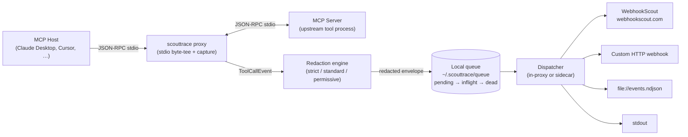

# ScoutTrace

A local, open-source CLI and MCP proxy that makes LLM tool-call observability trivial.

ScoutTrace sits between an MCP host (Claude Desktop, Claude Code, Cursor, Windsurf, Continue, Hermes, …) and the MCP servers it spawns. It byte-tees the JSON-RPC traffic so the host and server see exactly the bytes they would have seen without ScoutTrace, while a parallel capture pipeline builds a structured `ToolCallEvent` for every `tools/call` round-trip. Each event records *what* tool was invoked, *which* server handled it, *who* answered (success/error), and *how long* it took — never the raw conversation, and never anything that hasn't passed through redaction.

Captured events are written to a local on-disk queue, then dispatched to **any HTTP endpoint you configure**. The default destination is [WebhookScout](https://www.webhookscout.com), but ScoutTrace is destination-agnostic — point it at your own webhook, an internal sink, a local file, or `stdout`.

### What ScoutTrace gives you

- **Drop-in MCP proxy.** `scouttrace hosts patch` rewrites the host's MCP config so each server runs under `scouttrace proxy -- <upstream>`. Hosts and servers do not need to know ScoutTrace exists.
- **Structured `ToolCallEvent` envelopes.** Stable schema covering session, host, server, tool, request/response, timing, and the exact redaction policy hash applied.
- **Privacy-first redaction.** A `strict | standard | permissive` profile strips well-known secret patterns and PII, normalizes paths, and truncates oversized payloads *before* anything leaves the local process. Capture-level deny rules can drop fields entirely so they never enter the envelope.
- **Durable local queue.** A simple file-system queue (`pending/` → `inflight/` → `dead/`) survives crashes and restarts. The dispatcher claims rows atomically and applies exponential backoff with jitter on transient failures.
- **Pluggable destinations.** WebhookScout, generic HTTP webhook, NDJSON `file://...`, or `stdout`. Network destinations require explicit first-send approval.
- **Auditable, reversible host changes.** Every host-config patch is backed up; `scouttrace undo` restores the most recent backup. Setup and patching flows expose dry-run or rollback paths so you can inspect changes before trusting them.

### How it works



1. **Host patching.** `scouttrace hosts patch --host <id>` edits the host's MCP config (e.g. `claude_desktop_config.json`) so each registered MCP server is wrapped by `scouttrace proxy --server-name <name> -- <original-command>`. The original entry is preserved inside a marked block, and the prior file is copied to `~/.scouttrace/backups/<host>/...` so `scouttrace undo` can roll it back.
2. **Proxy + capture.** When the host launches a server, it actually launches `scouttrace proxy`. The proxy spawns the real upstream and byte-tees stdin/stdout in both directions — a JSON-RPC framer reads a parallel copy and emits a `ToolCallEvent` for each matched `tools/call` request/response pair.
3. **Redaction.** Each event is fed through the configured redaction policy *before it ever leaves the proxy process*. The resulting envelope records `redaction.policy_name` and `redaction.policy_hash` so consumers can verify what ran. Capture-level deny rules can prevent specific server/tool fields from being captured at all, providing a backstop independent of the redaction rules.
4. **Local queue.** Redacted envelopes are appended to `~/.scouttrace/queue/pending/`. The on-disk queue stores one compressed record per event; the dispatcher renames rows into `inflight/` atomically before delivery and into `dead/` after exhausting retries.
5. **Dispatch.** A dispatcher drains the queue and POSTs envelopes to each configured destination. It runs either in-process inside the proxy (for short-lived hosts) or as a long-running sidecar (`scouttrace start`). Network destinations are gated by first-send approval (`scouttrace destination approve …`) — until you explicitly approve, ScoutTrace will refuse to send to that host.
6. **Destinations.** ScoutTrace ships with four:
   - **`webhookscout`** — adapter for [WebhookScout](https://www.webhookscout.com). Tokens are referenced as `env://NAME` or `keychain://NAME`, never written to config in plaintext.
   - **`http`** — generic webhook; you supply the URL and an auth-header reference.
   - **`file`** — append redacted envelopes to a local NDJSON file (`file:///path/events.ndjson`).
   - **`stdout`** — print envelopes to stdout. Useful for `--dry-run`-style flows and CI.

> **Status:** Pre-alpha. The MVP CLI implementation exists in this repository and is installable from the Applexica Homebrew tap; signed standalone release binaries are still pending.

## Installation

### Quick install

```sh
brew tap Applexica/tap
brew install scouttrace
scouttrace version
```

The recommended macOS/Linux install path is the Applexica Homebrew tap. Source installation remains available for development and for platforms where Homebrew is not preferred.

### Homebrew tap (macOS and Linux)

```sh
brew tap Applexica/tap
brew install scouttrace
scouttrace version
```

To upgrade later:

```sh
brew update
brew upgrade scouttrace
```

### Source install

The commands below build the `scouttrace` binary locally from this repository and put it on your `PATH`.

### Prerequisites

- Git
- Go 1.22 or newer
- A terminal/shell for your platform

Verify Go is available:

```sh
go version
```

#### macOS

Install prerequisites with Homebrew if needed:

```sh
brew install git go
```

Build and install ScoutTrace:

```sh
git clone https://github.com/Applexica/ScoutTrace.git
cd ScoutTrace
go test ./...
go build -o scouttrace ./cmd/scouttrace
mkdir -p "$HOME/.local/bin"
mv scouttrace "$HOME/.local/bin/scouttrace"
```

Add `~/.local/bin` to your shell path if it is not already there:

```sh
echo 'export PATH="$HOME/.local/bin:$PATH"' >> ~/.zshrc
source ~/.zshrc
```

Verify installation:

```sh
scouttrace version
scouttrace --help
```

#### Linux

Install prerequisites. Debian/Ubuntu:

```sh
sudo apt-get update
sudo apt-get install -y git golang-go
```

Fedora/RHEL:

```sh
sudo dnf install -y git golang
```

Arch Linux:

```sh
sudo pacman -S --needed git go
```

Build and install ScoutTrace:

```sh
git clone https://github.com/Applexica/ScoutTrace.git
cd ScoutTrace
go test ./...
go build -o scouttrace ./cmd/scouttrace
mkdir -p "$HOME/.local/bin"
mv scouttrace "$HOME/.local/bin/scouttrace"
```

Add `~/.local/bin` to your shell path if needed:

```sh
echo 'export PATH="$HOME/.local/bin:$PATH"' >> ~/.bashrc
source ~/.bashrc
```

Verify installation:

```sh
scouttrace version
scouttrace --help
```

#### Windows

Install prerequisites:

1. Install Git for Windows: <https://git-scm.com/download/win>
2. Install Go 1.22 or newer: <https://go.dev/dl/>
3. Open PowerShell and verify both are available:

```powershell
git --version
go version
```

Build ScoutTrace:

```powershell
git clone https://github.com/Applexica/ScoutTrace.git
cd ScoutTrace
go test ./...
go build -o scouttrace.exe ./cmd/scouttrace
```

Install it into a user-local bin directory:

```powershell
New-Item -ItemType Directory -Force "$env:USERPROFILE\bin" | Out-Null
Move-Item .\scouttrace.exe "$env:USERPROFILE\bin\scouttrace.exe" -Force
```

Add that directory to your user `PATH` for future shells:

```powershell
$UserPath = [Environment]::GetEnvironmentVariable("Path", "User")
$Bin = "$env:USERPROFILE\bin"
if ($UserPath -notlike "*$Bin*") {
  [Environment]::SetEnvironmentVariable("Path", "$UserPath;$Bin", "User")
}
```

Close and reopen PowerShell, then verify installation:

```powershell
scouttrace version
scouttrace --help
```

#### Build without installing

If you only want to try ScoutTrace from a checkout:

```sh
go run ./cmd/scouttrace --help
go run ./cmd/scouttrace version
```

On Windows PowerShell, use the same commands.

### First setup after installation

For a safe local-only setup that sends captured events to stdout instead of the network:

```sh
scouttrace init --hosts none --destination stdout --yes
scouttrace doctor
```

For WebhookScout, use the portal-generated setup token or your WebhookScout configuration once those provisioning endpoints are available:

```sh
scouttrace init --destination webhookscout --setup-token <portal-setup-token> --yes
scouttrace doctor
```

> Do not paste API keys into MCP host config files. ScoutTrace config stores credential references such as `env://...` or `keychain://...`, not raw secrets.

### Updating from source

```sh
cd ScoutTrace
git pull
go test ./...
go build -o scouttrace ./cmd/scouttrace
mv scouttrace "$HOME/.local/bin/scouttrace"
```

On Windows, rebuild `scouttrace.exe` and move it back to `%USERPROFILE%\bin`.

### Future package managers

The following non-Homebrew install paths are planned but not yet published:

```sh
winget install WebhookScout.ScoutTrace
scoop install scouttrace
```

Until those packages exist, use Homebrew or the source installation steps above.

## Quick start

```sh
scouttrace init --hosts none --destination stdout --yes
scouttrace doctor
```

`scouttrace init` creates `~/.scouttrace/config.yaml`. Host patching can then be enabled with `scouttrace hosts patch` for supported MCP hosts (Claude Desktop, Claude Code, Cursor, Windsurf, Continue, Hermes). You can preview what will be captured before any network egress with `scouttrace preview --json`.

## How to use ScoutTrace

This section is a hands-on tour of every command in the MVP CLI. Run `scouttrace <command> --help` for a flag reference; the examples below cover the realistic workflows.

### Global flags

These work in front of any subcommand:

```sh
scouttrace --home /tmp/scout-isolated --config /tmp/scout-isolated/config.yaml status
scouttrace --json status
scouttrace -v hosts list      # -v = verbose, -vv = more verbose
```

`SCOUTTRACE_HOME` and `SCOUTTRACE_CONFIG` work as environment-variable equivalents of `--home` / `--config`.

### `scouttrace init` — create a config

`init` is the one-shot setup. The MVP build is non-interactive; pass `--yes`. Pick a destination and (optionally) the hosts to patch.

Local-only stdout setup, no host patching, no network egress:

```sh
scouttrace init --hosts none --destination stdout --yes
```

Stdout setup that also patches Claude Desktop and Cursor:

```sh
scouttrace init --hosts claude-desktop,cursor --destination stdout --yes
```

WebhookScout setup with a portal-generated setup token (replace `<portal-setup-token>` with the value from your WebhookScout console):

```sh
export SCOUTTRACE_ENCFILE_PASSPHRASE='choose-a-strong-passphrase'
scouttrace init \
  --destination webhookscout \
  --setup-token <portal-setup-token> \
  --hosts claude-desktop \
  --yes
```

Once you have exchanged the setup token for an API key, re-run `init` (or hand-edit the auth-header reference) so the dispatcher has a usable credential:

```sh
export SCOUTTRACE_WEBHOOKSCOUT_API_KEY='[REDACTED]'   # populate yourself; never commit
scouttrace init \
  --destination webhookscout \
  --auth-header-ref env://SCOUTTRACE_WEBHOOKSCOUT_API_KEY \
  --hosts none --yes
```

Custom HTTP webhook with a credential reference:

```sh
export MY_WEBHOOK_TOKEN='[REDACTED]'
scouttrace init \
  --destination https://hooks.example.internal/scouttrace \
  --auth-header-ref env://MY_WEBHOOK_TOKEN \
  --hosts none --yes
```

Append-to-file destination:

```sh
scouttrace init \
  --destination file:///var/log/scouttrace/events.ndjson \
  --hosts none --yes
```

Dry-run to print the planned config without writing it:

```sh
scouttrace init --hosts none --destination stdout --yes --dry-run
```

### `scouttrace hosts list|patch|unpatch` — manage MCP host configs

List all known hosts and whether their config files are present:

```sh
scouttrace hosts list
scouttrace hosts list --json
```

Patch a host so its MCP servers run under the proxy. The original config is backed up under `~/.scouttrace/backups/<host>/`:

```sh
scouttrace hosts patch --host claude-desktop
scouttrace hosts patch --host cursor --servers github,filesystem
scouttrace hosts patch --host claude-code --config-path /path/to/claude_code_config.json
```

If the host config has changed since the last patch (drift detection), the command refuses to write. Pass `--force` after reviewing:

```sh
scouttrace hosts patch --host claude-desktop --force
```

Remove the proxy wrapping but leave the host config in place (servers fall back to the originals embedded in the marker block):

```sh
scouttrace hosts unpatch --host claude-desktop
```

### `scouttrace proxy` — the stdio MCP proxy

You normally do not invoke `proxy` directly — `hosts patch` configures the host to do it for you. It is exposed for manual smoke tests and for hosts that ScoutTrace does not know how to patch:

```sh
scouttrace proxy --server-name github -- npx -y @modelcontextprotocol/server-github
```

Useful flags:

```sh
# Tee bytes only; do not run the capture pipeline.
scouttrace proxy --no-capture --server-name fs -- npx -y @modelcontextprotocol/server-filesystem /tmp

# Refuse to run if the capture pipeline cannot start (default: degrade gracefully).
scouttrace proxy --fail-closed --server-name fs -- npx -y @modelcontextprotocol/server-filesystem /tmp
```

### `scouttrace run` — exec a child with ScoutTrace env vars

A thin convenience for SDK shims (post-MVP) and tests. It sets `SCOUTTRACE_ENABLED=1` and a fresh `SCOUTTRACE_SESSION_ID` in the child's environment:

```sh
scouttrace run -- python ./my-agent.py
scouttrace run -- node ./tools/probe.mjs --flag
```

### `scouttrace start|stop|restart` — dispatcher sidecar

For most setups the in-proxy dispatcher is enough. Run a long-lived sidecar when you have multiple proxies sharing a queue, or when you want dispatch to continue while no host is open.

```sh
scouttrace start              # foreground; PID written to ~/.scouttrace/dispatch.pid
scouttrace start --yes        # auto-approve any unseen network destinations
scouttrace start --once       # one drain pass and exit (useful for cron / CI)
scouttrace start --timeout 30s   # exit after 30s (useful for tests)

scouttrace stop                  # graceful SIGTERM, waits up to 5s
scouttrace stop --timeout 10s    # wait longer
scouttrace stop --force          # SIGKILL after timeout

scouttrace restart               # stop, then start
```

### `scouttrace status` — queue + dispatcher snapshot

```sh
scouttrace status
scouttrace status --json
```

Sample output:

```
ScoutTrace 0.1.0
Home: /Users/you/.scouttrace
Queue: pending=0 inflight=0 dead=0
Dispatcher: not running (queued events flush via proxy)
Destinations: 1 configured
```

### `scouttrace doctor` — self-check

`doctor` validates the config, opens the queue, round-trips a synthetic event through `enqueue → claim → ack`, and constructs each destination adapter (without sending). It exits non-zero if any check fails.

```sh
scouttrace doctor
scouttrace doctor --json
```

### `scouttrace preview` — what redaction looks like

Synthesize a representative `ToolCallEvent` containing the kinds of secrets the redaction engine knows about, then print the pre- and post-redaction envelopes side-by-side:

```sh
scouttrace preview                       # human-readable diff
scouttrace preview --profile strict      # try a different profile
scouttrace preview --json                # emit just the redacted ToolCallEvent
scouttrace preview --json --with-meta    # also include applied rules + field paths
```

Pipe a synthesized redacted envelope into the queue for a true end-to-end test:

```sh
scouttrace preview --json | scouttrace queue inject --destination default
```

### `scouttrace config show|validate|get|set`

```sh
scouttrace config show                          # full effective config (JSON)
scouttrace config show --json
scouttrace config validate                      # validate the active config
scouttrace config validate --config ./alt.yaml  # validate a specific file

scouttrace config get default_destination
scouttrace config get redaction.profile
scouttrace config get destinations              # walks the JSON tree

scouttrace config set default_destination default
scouttrace config set redaction.profile strict
scouttrace config set delivery.initial_backoff_ms 1000
scouttrace config set delivery.max_backoff_ms 120000
scouttrace config set queue.path /var/lib/scouttrace/queue
```

`config set` only accepts a vetted allow-list of keys in the MVP. For everything else, edit `~/.scouttrace/config.yaml` directly and run `scouttrace config validate`.

### `scouttrace destination list|approve|approve-host`

Network destinations require an explicit first-send approval before any envelope leaves your machine.

```sh
scouttrace destination list             # shows [x] approved / [ ] not approved
scouttrace destination list --json

# Approve a specific named destination from your config.
scouttrace destination approve default

# Approve every destination of a given type that targets a specific network host.
# Useful for letting a whole environment talk to a single endpoint.
scouttrace destination approve-host http hooks.example.internal
scouttrace destination approve-host webhookscout api.webhookscout.com
```

`scouttrace start --yes` and `scouttrace flush --yes` auto-approve missing entries and write an audit log line; use that only when you are sure of where you are pointing.

### `scouttrace queue stats|list|inject|flush|prune`

Inspect the on-disk queue:

```sh
scouttrace queue stats                    # pending=N inflight=N dead=N
scouttrace queue stats --json

scouttrace queue list                     # last 50 records, NDJSON
scouttrace queue list --limit 200
scouttrace queue list --destination default
```

Manually enqueue an envelope (handy for replays and debugging):

```sh
scouttrace queue inject --from ./event.json --destination default
cat event.json | scouttrace queue inject --destination default
scouttrace preview --json | scouttrace queue inject --destination default
```

Drive a single drain pass (the dispatcher does this in the background, but `flush` is great for CI):

```sh
scouttrace queue flush
scouttrace queue flush --destination default
scouttrace queue flush --to default --yes      # alias and auto-approve
scouttrace flush                                 # top-level shortcut
scouttrace flush --destination default
```

Trim aged-out dead-lane entries:

```sh
scouttrace queue prune                     # default --max-age-days 7
scouttrace queue prune --max-age-days 30
```

### `scouttrace tail` — stream the queue

```sh
scouttrace tail                           # follow new events as NDJSON
scouttrace tail --once                    # snapshot of the current pending list and exit
scouttrace tail --destination default
scouttrace tail --limit 200 --format pretty
scouttrace tail --format json             # one JSON array per poll
```

`--raw` is intentionally refused: ScoutTrace does not store pre-redaction envelopes by default.

### `scouttrace replay` — re-deliver from an NDJSON file

Re-enqueue every line of an NDJSON file for delivery to a destination. If the line already has an `id`, that id is preserved so downstream consumers can deduplicate.

```sh
scouttrace replay --from ./exported-events.ndjson
scouttrace replay --from ./exported-events.ndjson --destination default
scouttrace replay --from /var/log/scouttrace/events.ndjson --destination my-internal-sink
```

### `scouttrace policy show|lint|test`

Inspect a built-in redaction profile:

```sh
scouttrace policy show                       # standard profile
scouttrace policy show --profile strict
scouttrace policy show --profile permissive
scouttrace policy show --json
```

Lint a custom policy file:

```sh
scouttrace policy lint --path ./policies/custom.json
```

Test what a profile would do to a real captured event:

```sh
scouttrace policy test --profile strict --path ./sample-event.json
cat sample-event.json | scouttrace policy test --profile standard
scouttrace preview --json | scouttrace policy test --profile strict
```

### `scouttrace undo` — restore a host config

Roll back the most recent host-config patch using the on-disk backup:

```sh
scouttrace undo --host claude-desktop          # restore one host
scouttrace undo --all                           # restore every host with backups
scouttrace undo --list --host cursor            # list available backups, do not restore
scouttrace undo --host claude-desktop --config-path /alt/path/claude_desktop_config.json
```

`undo` updates the config bookkeeping for the restored host and writes an audit-log entry.

### `scouttrace version`

```sh
scouttrace version
scouttrace version --json
```

### Troubleshooting recipes

A queue that won't drain — check approval and the dispatcher:

```sh
scouttrace status
scouttrace destination list
scouttrace doctor
scouttrace queue flush --destination default --yes   # one drain pass with auto-approve
```

A redaction policy you're unsure about — preview, then lint, then test:

```sh
scouttrace preview --profile strict
scouttrace policy show --profile strict
scouttrace policy test --profile strict --path ./real-event.json
```

A host config that ScoutTrace shouldn't have touched — back out:

```sh
scouttrace undo --host claude-desktop
scouttrace hosts list                                   # confirm `[ ]` patched flag is gone
```

A new destination you want to try locally before pointing at the network:

```sh
scouttrace --home /tmp/scout-test init --destination stdout --hosts none --yes
scouttrace --home /tmp/scout-test preview --json \
  | scouttrace --home /tmp/scout-test queue inject --destination default
scouttrace --home /tmp/scout-test queue flush
```

## Privacy & trust

- **No network egress without an explicit destination.** `stdout`, `file://...`, or a custom HTTP URL are first-class alternatives to WebhookScout.
- **Redaction on by default.** The `strict` profile strips well-known secret patterns and PII, normalizes paths, and truncates oversized payloads.
- **Capture-level deny.** Fields you don't capture can't leak, even if a redaction rule has a bug.
- **Inspectable where it matters.** Setup and host-patching flows support dry-run or rollback paths. `scouttrace undo` reverts host patches from on-disk backups.
- **No hidden phone-home.** Self-telemetry is off by default; auto-update is never performed.

See [§17 Security & Threat Model](./docs/PRD.md#17-security--threat-model) and [§13 Redaction & Capture Policies](./docs/PRD.md#13-redaction--capture-policies) for details.

## Documentation

- [**Product Requirements Document**](./docs/PRD.md) — full spec: CLI taxonomy, config schema, payload schema, redaction policies, host-config patching, security model, MVP milestones, acceptance criteria, and testing strategy.
- [**Technical Design Document**](./docs/TECHNICAL_DESIGN.md) — implementation-level companion to the PRD: package layout, process model, wire-protocol details, queue schema, host-patching algorithms, and step-by-step testing procedures.

## License

Apache-2.0. See [LICENSE](./LICENSE).
