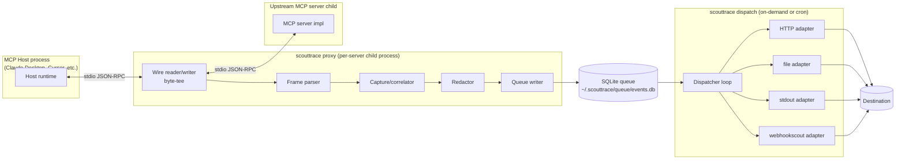
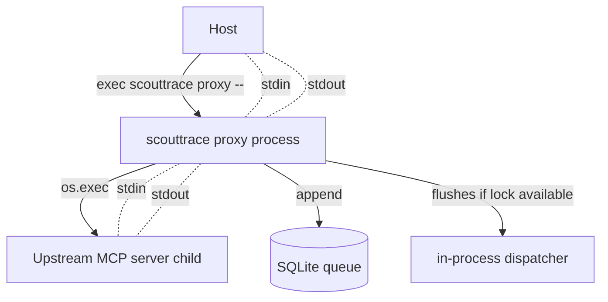
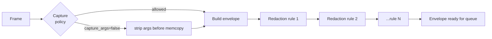
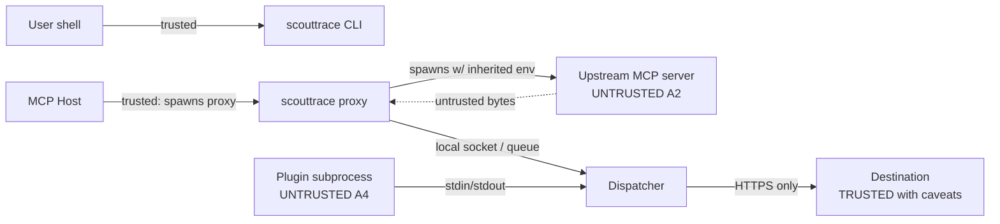

# ScoutTrace — Technical Design Document

**Status:** Draft v0.1 (companion to PRD v0.1)
**Audience:** Engineers implementing ScoutTrace MVP (M0–M7).
**Last updated:** 2026-04-30
**Related docs:** [PRD](./PRD.md)

This document translates the PRD into an implementable design. Where the PRD answers *what* and *why*, this document answers *how*: package layout, data flow, algorithms, schemas, error paths, and the exact procedures that prove the system meets its acceptance criteria.

The PRD is the source of truth for product behavior. Where this document and the PRD disagree, the PRD wins; file an issue and update one of them.

---

## Table of Contents

1. [Goals of this Document](#1-goals-of-this-document)
2. [Architecture Overview](#2-architecture-overview)
3. [Implementation Language Recommendation](#3-implementation-language-recommendation)
4. [Repository Layout & Core Packages](#4-repository-layout--core-packages)
5. [Process Model](#5-process-model)
6. [MCP stdio Proxy: Wire Protocol Details](#6-mcp-stdio-proxy-wire-protocol-details)
7. [JSON-RPC Parsing & Correlation](#7-json-rpc-parsing--correlation)
8. [Event Data Model](#8-event-data-model)
9. [Redaction Pipeline](#9-redaction-pipeline)
10. [Credential & Keychain Handling](#10-credential--keychain-handling)
11. [Destination Adapters](#11-destination-adapters)
12. [Local Durable Queue: Schema & Retry Logic](#12-local-durable-queue-schema--retry-logic)
13. [Host Detection & Patching Algorithms](#13-host-detection--patching-algorithms)
14. [Config Schema & Validation](#14-config-schema--validation)
15. [Failure Modes & Recovery](#15-failure-modes--recovery)
16. [Security Boundaries](#16-security-boundaries)
17. [Self-Observability](#17-self-observability)
18. [Command Lifecycles](#18-command-lifecycles)
19. [Testing Procedures](#19-testing-procedures)
20. [Appendix A: Wire Format Reference](#20-appendix-a-wire-format-reference)
21. [Appendix B: Error Code Catalog](#21-appendix-b-error-code-catalog)

---

## 1. Goals of this Document

This document is implementable. By "implementable" we mean:

- A new engineer can pick up any §4 package and start coding without re-reading the PRD.
- Each algorithm has either pseudocode, a flow diagram, or both.
- Every test in §19 specifies fixture data, exact commands, expected outcome, and pass/fail criteria — no "verify it works."
- Where the PRD lists an acceptance criterion (AC-Wn / AC-Rn / AC-Qn / AC-Hn / AC-Sn / AC-Pn / AC-Un), §19 provides the test that proves it.

Non-goals:

- Re-stating product rationale (see PRD §1–§3).
- Final UI copy (PRD §22 is canonical).
- Post-MVP design (HTTP proxy mode, plugin protocol, SDK shims) is sketched but not detailed.

---

## 2. Architecture Overview

ScoutTrace runs as a set of short-lived processes invoked by MCP hosts (one `scouttrace proxy` per upstream MCP server) plus on-demand CLI processes for setup, tail, doctor, etc. A long-running dispatcher is **optional**, not required for the happy path: the first active proxy can flush the local queue in-process, while `scouttrace start` can be used by teams that want an always-on background dispatcher. Persistence and coordination happen through a SQLite-backed local queue.

### 2.1 High-level data flow



### 2.2 Three guarantees the architecture must preserve

1. **Wire transparency.** The bytes from host → upstream and upstream → host are not mutated, reordered, or buffered beyond a frame. The wire path is the only path that *must* stay healthy.
2. **Capture isolation.** A panic, parse error, OOM, or queue failure in the capture/redact/queue path cannot block, corrupt, or kill the wire path.
3. **Durable at-least-once.** Once an event is appended to the queue, it survives process death, OS crash, and destination outage.

Every later section preserves these three properties. If a design choice violates one, it is wrong.

---

## 3. Implementation Language Recommendation

**Recommendation: Go (1.22+).**

### 3.1 Why Go

- **Cross-compilation is trivial.** `GOOS`/`GOARCH` produces static binaries for the five PRD-targeted platforms (darwin-arm64, darwin-x64, linux-x64, linux-arm64, windows-x64) from one CI runner.
- **Goroutines fit the wire model.** Two goroutines per direction (read/write) plus a non-blocking channel into the capture pipeline maps directly to PRD §9.2. No async runtime to wrestle with.
- **Stdlib is enough.** `encoding/json`, `database/sql` + `modernc.org/sqlite` (pure-Go, no cgo), `os/exec`, `os/signal`, `crypto/tls`, `compress/gzip` cover ~95% of MVP needs.
- **Lower contributor barrier.** ScoutTrace is open-source-first (PRD §18). Go has the broader contributor pool of the realistic candidates.
- **OS keychain bindings exist.** `github.com/zalando/go-keyring` handles macOS Keychain, Windows Credential Manager, and Secret Service / libsecret behind one API.

### 3.2 Why not Rust

Rust is the second-best choice. Its main advantages — predictable memory footprint and zero-runtime — matter most on the wire path. We accept slightly higher RSS (still well under AC-P2's 50 MB ceiling) in exchange for faster development velocity and easier OSS contributions.

If profiling shows we're approaching AC-P2 in practice, we keep the option to rewrite the `wire/` and `proxy/` packages in Rust and expose them via cgo. The package boundaries in §4 are designed to make that swap mechanical.

### 3.3 Why not Node / TypeScript

- Distribution is messier (need bundled Node or a binary packer like `pkg`).
- Stdio handling on Windows has historic edge cases.
- A Node MCP host running our Node proxy creates a confusing dependency story for users.
- Memory baseline is too high to comfortably hit AC-P2.

### 3.4 Toolchain & dependency rules

- Go 1.22+. Module path `github.com/webhookscout/scouttrace`.
- Vendored dependencies (`go mod vendor`), checked-in `vendor/` for reproducible builds (PRD §18.2).
- Deps must be permissively-licensed (MIT/BSD/Apache-2). Track licenses in `THIRD_PARTY_LICENSES`.
- No cgo on the wire / queue path (use `modernc.org/sqlite`, not `mattn/go-sqlite3`).
- Linters: `golangci-lint` with `staticcheck`, `errcheck`, `gosec`, `revive`.

---

## 4. Repository Layout & Core Packages

```
scouttrace/
├── cmd/
│   └── scouttrace/                # main; thin wiring; subcommands dispatch to internal/cli
│       └── main.go
├── internal/
│   ├── cli/                       # cobra commands; one file per top-level subcommand
│   │   ├── init_cmd.go
│   │   ├── proxy_cmd.go
│   │   ├── run_cmd.go
│   │   ├── tail_cmd.go
│   │   ├── doctor_cmd.go
│   │   ├── undo_cmd.go
│   │   ├── status_cmd.go
│   │   ├── replay_cmd.go
│   │   ├── policy_cmd.go
│   │   ├── hosts_cmd.go
│   │   ├── config_cmd.go
│   │   └── queue_cmd.go
│   ├── wire/                      # WIRE PATH ONLY. No capture/queue/destination imports allowed.
│   │   ├── frame.go               # newline-delimited JSON-RPC frame reader/writer
│   │   ├── tee.go                 # bidirectional byte tee w/ panic isolation
│   │   └── signals.go             # SIGTERM/SIGINT propagation w/ shutdown_grace_ms
│   ├── proxy/                     # orchestrator: spawns upstream, wires stdio, hands frames to capture
│   │   ├── proxy.go
│   │   └── lifecycle.go
│   ├── jsonrpc/                   # parsing, validation, request/response correlation
│   │   ├── parse.go
│   │   ├── correlate.go
│   │   └── methods.go             # constants for tools/call, initialize, etc.
│   ├── event/                     # ToolCallEvent envelope construction; ULID/IDs; schema constants
│   │   ├── envelope.go
│   │   ├── ulid.go
│   │   └── schema.go
│   ├── redact/                    # rule engine, built-in profiles, capture-level deny
│   │   ├── engine.go
│   │   ├── profiles.go            # embedded strict/standard/permissive YAML
│   │   ├── patterns.go
│   │   └── policy.go
│   ├── queue/                     # SQLite-backed durable queue
│   │   ├── sqlite.go
│   │   ├── schema.sql             # embedded
│   │   ├── enqueue.go
│   │   ├── dequeue.go
│   │   └── prune.go
│   ├── dispatch/                  # batches → adapters; backoff; idempotency
│   │   ├── dispatcher.go
│   │   ├── batch.go
│   │   └── backoff.go
│   ├── destinations/              # adapter implementations
│   │   ├── adapter.go             # Adapter interface
│   │   ├── http/
│   │   │   └── http.go
│   │   ├── file/
│   │   │   └── file.go
│   │   ├── stdout/
│   │   │   └── stdout.go
│   │   └── webhookscout/
│   │       ├── webhookscout.go    # default destination — ISOLATED PACKAGE for auditability
│   │       └── auth.go
│   ├── creds/                     # keychain abstraction; env / encrypted-file fallbacks
│   │   ├── store.go
│   │   ├── keychain_darwin.go
│   │   ├── keychain_windows.go
│   │   ├── keychain_linux.go
│   │   ├── envstore.go
│   │   └── encfile.go
│   ├── config/                    # YAML + JSON-Schema validation; migrations
│   │   ├── load.go
│   │   ├── schema.go              // embeds schemas/config.v1.json
│   │   ├── validate.go
│   │   └── migrate.go
│   ├── hosts/                     # detection + patch/unpatch per host
│   │   ├── registry.go            # host descriptors
│   │   ├── detect.go
│   │   ├── patch.go               # atomic write w/ backup+verify
│   │   ├── claudedesktop.go
│   │   ├── claudecode.go
│   │   ├── cursor.go
│   │   ├── windsurf.go
│   │   ├── continuehost.go
│   │   └── hermes.go
│   ├── wizard/                    # init flow state machine + survey-style UI
│   │   ├── wizard.go
│   │   └── survey.go
│   ├── selftelemetry/             # OFF by default; PRD §19.1
│   │   └── selftelemetry.go
│   ├── audit/                     # ~/.scouttrace/audit.log writer; PRD §17.3
│   │   └── audit.go
│   └── version/
│       └── version.go             # set via -ldflags at build time
├── schemas/
│   └── config.v1.json             # JSON-Schema for config.yaml
├── testdata/
│   ├── calls/                     # 1000-event golden corpus (PRD §25.2)
│   ├── hosts/                     # snapshots of each host's config at multiple versions
│   ├── policies/                  # custom-policy fixtures
│   └── redaction/                 # before/after pairs for `scouttrace policy test`
├── docs/
│   ├── PRD.md
│   ├── TECHNICAL_DESIGN.md        # this file
│   └── release-checklist.md
├── scripts/
│   ├── release.sh                 # SLSA-attested build
│   └── conformance.sh
└── go.mod
```

### 4.1 Package dependency rules (enforced via `golangci-lint depguard`)

- `wire/` must not import `capture`, `redact`, `queue`, `dispatch`, `destinations`, `config`, `hosts`. It only depends on stdlib + a small `event/` callback type.
- `destinations/webhookscout/` must not be reachable from any other adapter or from `dispatch/` except through the `destinations.Adapter` interface registered at startup. This preserves the PRD §18.4 auditability boundary.
- `cli/` may import anything, but no other `internal/*` package may import `cli/`.

A unit test in `internal/depguard_test.go` walks the module graph and fails CI if any import is added that violates these rules.

---

## 5. Process Model

ScoutTrace has four runtime modes. The default MCP-host path does not require a long-running daemon, but a user may opt into `scouttrace start` for always-on delivery.

### 5.1 Proxy mode (`scouttrace proxy`)

Spawned by the host. One process per upstream MCP server.



- The proxy process is the parent of the upstream child.
- It owns 5 goroutines per server:
  1. `host→proxy` stdin reader
  2. `proxy→upstream` stdin writer
  3. `upstream→proxy` stdout reader
  4. `proxy→host` stdout writer
  5. capture scheduler (reads from a bounded channel; fans out to `min(4, ncpu)` redaction workers; writes completed envelopes to queue)
- On exit (EOF in either direction, signal, or upstream death), it joins the wire goroutines, drains the capture channel for up to 250ms, then exits.

### 5.2 Dispatch mode (`scouttrace start` or in-proxy)

The dispatcher reads from the queue and POSTs to destinations. It runs in one of three ways, in priority order:

1. **Explicit sidecar.** `scouttrace start` starts a local foreground/background dispatcher process that holds `~/.scouttrace/dispatch.lock`, watches the queue, and exits only on `scouttrace stop` / SIGTERM / host shutdown. This is optional but recommended for team-managed workstations and for users who want queued events to flush even when no MCP host is running.
2. **In-proxy.** When `scouttrace proxy` starts and detects no other dispatcher holds the lock file, it acquires the lock and starts an in-process dispatcher goroutine. This keeps the default "no daemon required" path working.
3. **On-demand.** `scouttrace flush`, `scouttrace doctor`, and `scouttrace replay` may run a one-shot dispatcher pass while holding the lock.

The dispatch lock is a POSIX `flock` (Linux/mac) or `LockFileEx` (Windows) on `~/.scouttrace/dispatch.lock`. If the lock-holder dies, the lock is released by the OS; the next `start`, `proxy`, or one-shot dispatcher picks it up.

`scouttrace stop` looks up the sidecar PID file (`~/.scouttrace/dispatch.pid`), sends a graceful termination signal, waits up to 5 seconds, and then reports whether the lock was released. It never kills in-proxy dispatchers because those are owned by MCP host child processes.

### 5.3 CLI mode

Read-only commands (`status`, `tail`, `policy show`, `config show`, `hosts list`) open the SQLite queue with `?mode=ro` and the config in read-only. They never write.

State-changing commands (`init`, `hosts patch`, `config set`, `undo`) acquire `~/.scouttrace/state.lock` for the duration of the change to serialize concurrent CLI invocations.

### 5.4 Lockfiles & directories

```
~/.scouttrace/
├── config.yaml
├── credentials.enc            # only if encrypted-file fallback used
├── audit.log
├── audit.log.1                # rotated, 10 MB cap
├── state.lock                 # serializes config-mutating CLI commands
├── dispatch.lock              # held by current dispatcher
├── dispatch.pid               # sidecar PID when scouttrace start is active
├── queue/
│   ├── events.db              # SQLite WAL
│   ├── events.db-wal
│   └── events.db-shm
├── backups/
│   ├── claude-desktop/
│   │   └── 2026-04-30T12-34-56Z.json
│   └── cursor/
│       └── 2026-04-30T12-34-56Z.json
├── plugins/                   # post-MVP
└── ca.pem                     # post-MVP (HTTP proxy mode)
```

All files created with mode 0600, all directories 0700. Mode is asserted at startup; if any directory is more permissive, ScoutTrace prints a warning and chmods it.

---

## 6. MCP stdio Proxy: Wire Protocol Details

### 6.1 Framing

MCP over stdio uses **newline-delimited JSON-RPC 2.0**. Each frame:

```
<json-object>\n
```

- UTF-8.
- No leading whitespace.
- No embedded newlines inside the JSON (whitespace permitted only outside the object's escaped strings; the framer treats `\n` as the unambiguous terminator because well-formed JSON does not contain bare newlines in tokens).
- Maximum capture frame size: 16 MiB (configurable via `wire.max_frame_bytes`). This limit applies to the **capture parser only**, not to the byte-forwarding path. Oversized frames are forwarded unchanged, counted as `oversize_frames_total`, and skipped for capture under `--fail-open`. Only `--fail-closed` plus `wire.strict_frame_cap=true` may reject an oversized frame before forwarding.

The capture framer uses a `bufio.Scanner` with `MaxScanTokenSize` raised to `wire.max_frame_bytes` and a custom `SplitFunc`. The wire-forwarding goroutine must not depend on this scanner to preserve pass-through behavior for frames larger than the capture cap:

```
SplitFunc(data, atEOF):
    if i := IndexByte(data, '\n'); i >= 0 {
        return i + 1, data[:i], nil   // advance past newline; return frame without it
    }
    if atEOF && len(data) > 0 {
        return 0, nil, ErrTruncatedFrame
    }
    return 0, nil, nil                 // need more data
```

### 6.2 Byte-tee invariant

The wire-path goroutines must not depend on the capture path. Concretely:

```go
// pseudo-code; see internal/wire/tee.go
func teeReader(src io.Reader, dst io.Writer, capCh chan<- []byte) error {
    sc := newFrameScanner(src)
    for sc.Scan() {
        frame := sc.Bytes()         // reused buffer; valid until next Scan()
        // 1. forward FIRST. Wire path must not be blocked by capture.
        if _, err := dst.Write(frame); err != nil {
            return err
        }
        if _, err := dst.Write([]byte{'\n'}); err != nil {
            return err
        }
        // 2. enqueue capture (non-blocking copy)
        select {
        case capCh <- copyBytes(frame):
        default:
            atomic.AddUint64(&captureDropped, 1)
        }
    }
    return sc.Err()
}
```

- `dst.Write` happens **before** the capture send. If the queue is slow or the capture parser rejects an oversized frame, we drop captures, never bytes.
- The frame is **copied** before being put on the channel, because `bufio.Scanner.Bytes()` reuses its internal buffer.
- The capture channel is bounded (default 1024 frames per direction).
- A capture-side panic is recovered in the consumer goroutine, never on the wire goroutines (they never call into capture).

### 6.3 Initialization handshake

Per PRD §10.2, the proxy must record the negotiated protocol version and capabilities but never modify the handshake.

The capture worker holds per-session state:

```go
type sessionState struct {
    serverName       string
    protocolVersion  string  // from initialize result
    capabilities     []string
    serverInfo       map[string]any
    initialized      bool
    sessionID        ulid.ULID
}
```

On the first response to `method == "initialize"`, the worker fills these fields and emits a single `session_started` event (an envelope with no `tool` block; `schema = "scouttrace.session.v1"`). All subsequent `tool_call` events in this proxy lifetime share the same `session_id`.

### 6.4 Shutdown

```mermaid
sequenceDiagram
    participant H as Host
    participant P as scouttrace proxy
    participant U as Upstream MCP server
    H-->>P: SIGTERM (or stdin EOF)
    P->>U: forward SIGTERM
    P->>P: stop accepting new frames; close stdin to U
    P->>P: wait for in-flight upstream→host frames (≤ shutdown_grace_ms = 3000)
    alt upstream exited cleanly
        P->>P: drain capture channel (≤ 250 ms)
        P-->>H: stdout EOF
        P->>P: exit 0
    else timeout
        P->>U: SIGKILL
        P-->>H: stdout EOF
        P->>P: exit 0 (queue still flushed)
    end
```

EOF in either direction must be forwarded within 50 ms (PRD §10.1). In practice this is automatic because the wire goroutines block on `Read` and unblock on EOF.

If the upstream exits non-zero, the worker emits a `server_crashed` envelope including `exit_code`, `last_25_tool_names`, and (if `--capture-stderr-tail` set) the last 4 KB of upstream stderr after passing it through the redactor.

### 6.5 Fail-open vs fail-closed

`--fail-open` (default) and `--fail-closed` decide what happens when the **capture pipeline** cannot start (DB locked, disk full, schema mismatch). They do **not** change wire behavior at runtime — wire is always best-effort.

```
on startup:
    err := initCapture()
    if err != nil:
        if --fail-open:
            log warn; capture disabled; wire path still runs
        else:    # --fail-closed
            log error; exit 2 BEFORE forwarding any host bytes to upstream
```

`--fail-closed` only takes effect during init. Once wire is running, no condition causes us to tear it down.

---

## 7. JSON-RPC Parsing & Correlation

### 7.1 Parser

The capture worker parses each frame into a minimal struct:

```go
type rpcMessage struct {
    JSONRPC string          `json:"jsonrpc"`
    ID      json.RawMessage `json:"id,omitempty"`      // string OR number; preserve raw
    Method  string          `json:"method,omitempty"`  // present on requests + notifications
    Params  json.RawMessage `json:"params,omitempty"`
    Result  json.RawMessage `json:"result,omitempty"`
    Error   json.RawMessage `json:"error,omitempty"`
}
```

- `ID` is kept as `RawMessage` because JSON-RPC IDs may be strings or numbers and we must preserve original bytes for correlation.
- Failure to parse is a counted, non-fatal error (`jsonrpc_parse_errors_total`). The wire path already forwarded the bytes; we just skip the capture.

### 7.2 Direction tagging

The teeReader tags each frame with its direction before passing to the worker:

```go
type framedMsg struct {
    dir       direction       // host→upstream OR upstream→host
    frame     []byte
    receivedAt time.Time      // monotonic + wall clock
}
```

### 7.3 Correlation table

A single map per session, keyed by canonical-stringified ID:

```go
type pending struct {
    method     string
    params     json.RawMessage
    startedAt  time.Time
    spanID     [8]byte
}

type correlator struct {
    mu      sync.Mutex
    inflight map[string]pending     // key: canonical ID string
    maxAge  time.Duration            // garbage-collect orphans (default 5m)
}
```

Correlation rules:

- Host→upstream frames with a `Method` and an `ID`: store in `inflight` keyed by `canonicalID(ID)`.
- Upstream→host frames with an `ID` and either `Result` or `Error`: look up; if found, emit one `ToolCallEvent` (or a generic `RpcEvent` for non-`tools/call`); if not found, increment `correlation_misses_total`.
- Notifications (`Method` set, no `ID`) are emitted as `notification` events without a request side.
- IDs are **canonicalized**: `42` and `"42"` are different keys (per JSON-RPC spec). `canonicalID(raw) := string(raw)` after `json.Compact` (strip whitespace).

### 7.4 Garbage collection

Every 30 seconds, entries older than `maxAge` (5 min default) are evicted, counted in `correlation_orphans_total`, and emitted as `partial` events with `response.ok = false, response.error = {"code":-32000,"message":"orphan: no response within 300s"}`.

### 7.5 What gets a full event vs. metadata-only

Per PRD §10.3:

| Method | Capture |
|---|---|
| `initialize` | `session_started` envelope — metadata only |
| `tools/list` | metadata only — record `result.tools.length` and a hash of the schema array |
| `tools/call` | full `ToolCallEvent` |
| `resources/read`, `resources/list` | metadata only — record method, latency, ok/err |
| `prompts/get`, `prompts/list` | metadata only |
| `notifications/*` | counted; no envelope unless `level==error` |
| `ping` | suppressed |

The `methods.go` table maps method → `captureLevel` (one of `Full`, `Metadata`, `Counted`, `Suppressed`).

---

## 8. Event Data Model

### 8.1 `ToolCallEvent` — canonical schema

Defined in PRD §12.1. The Go type:

```go
type ToolCallEvent struct {
    ID            string         `json:"id"`             // ULID
    Schema        string         `json:"schema"`         // "scouttrace.toolcall.v1"
    CapturedAt    time.Time      `json:"captured_at"`
    SessionID     string         `json:"session_id"`
    TraceID       string         `json:"trace_id,omitempty"`
    SpanID        string         `json:"span_id,omitempty"`
    Source        SourceBlock    `json:"source"`
    Server        ServerBlock    `json:"server"`
    Tool          ToolBlock      `json:"tool"`
    Request       RequestBlock   `json:"request"`
    Response      ResponseBlock  `json:"response"`
    Timing        TimingBlock    `json:"timing"`
    Redaction     RedactionBlock `json:"redaction"`
}
```

### 8.2 ID generation

- Event `id`: ULID (`github.com/oklog/ulid/v2`). Monotonic within a session for deterministic ordering. Used as the **idempotency key** end-to-end.
- `session_id`: ULID generated at proxy startup, never reused.
- `trace_id`/`span_id`: generated per event when no upstream OTel context exists. Hex strings: 16 bytes / 8 bytes respectively. Post-MVP: extract from `_meta` if upstream MCP servers begin propagating it.

### 8.3 Schema versioning

- `schema` is **append-only across minor versions** (PRD §12.2).
- Removing or retyping a field bumps the minor identifier: `scouttrace.toolcall.v2`.
- `internal/event/schema.go` holds the `SchemaVersion` constant. CI fails if a struct field is removed or its `json:"name"` changes without a corresponding constant bump.

### 8.4 Envelope size budgets

The redacted, compressed envelope must fit in the queue row's `payload BLOB`. Hard cap:

- Pre-compression envelope: **2 MB**. If the redacted envelope exceeds 2 MB after redaction, additional truncation runs against `request.args` first, then `response.result`, then both `*_truncated` flags are set.
- Post-gzip BLOB: target ≤ 256 KB; not enforced as an error.

---

## 9. Redaction Pipeline

### 9.1 Two-phase model

Per PRD §13.4, capture-level rules run **before** any data enters ScoutTrace memory; redaction-level rules run on the captured envelope. Both are described in the same policy file but evaluated at different points.



### 9.2 Rule engine

Rules execute in declared order. Each rule is one of four `type`s:

| `type` | Action |
|---|---|
| `truncate` | If `field` (JSON pointer) byte-size > `limit_bytes`, replace with `placeholder` and set `*_truncated = true` and `*_bytes_original = N`. |
| `redact_pattern` | For each `pattern`, run a precompiled `regexp` against every string leaf reachable from the JSON tree. Replace matches with `placeholder` (templated with `${pattern_name}`). |
| `transform` | For string leaves whose **field name** matches `fields_match_regex`, run `replace.from → replace.to`. Supports `${HOME}` and `${VAR}` template expansion. |
| `drop` | Remove the entire subtree at each `field_path`. |

### 9.3 Field paths

We use a subset of JSON Pointer (RFC 6901) plus glob suffix `.*`:

- `request.args.password` → exact path
- `request.args.*` → any direct child of args
- `response.result.items.*.token` → array glob

Validation: `scouttrace policy lint` rejects field paths containing `..`, leading `/`, or non-printable characters.

### 9.4 Pattern engine

- Built on Go's `regexp` (RE2). Linear time guaranteed; no catastrophic backtracking.
- `regexp` instances are compiled at policy load time and cached. Reload on `SIGHUP`.
- A panic-safety harness wraps each rule application. If a rule panics on a particular envelope, the envelope is dropped, an `redact_panics_total` counter is incremented, and the rule is **disabled for the remainder of the process lifetime** to prevent a poison-pill rule from killing throughput. The `status` command surfaces disabled rules.

### 9.5 Built-in profile loading

`internal/redact/profiles.go` embeds the three built-in YAML profiles using `//go:embed`. Their hashes are computed at build time and exposed as `policy_hash`. The hash appears in every event's `redaction.policy_hash` so receivers can detect policy drift across a fleet.

### 9.6 Policy reload

On `SIGHUP`, the policy YAML is re-read, re-validated, and atomically swapped behind an `atomic.Pointer[Policy]`. In-flight envelopes finish under the old policy.

### 9.7 Capture-level deny — the privacy backstop

Capture-level deny is implemented in the **capture worker**, before the envelope is constructed:

```go
if !captureRules.shouldCaptureArgs(server, tool) {
    request.Args = json.RawMessage(`null`)   // never read into the in-memory envelope
}
```

This is the AC-R2 backstop: if `capture_args=false`, the args bytes never leave the wire goroutine's stack-allocated buffer; nothing can leak them.

---

## 10. Credential & Keychain Handling

### 10.1 Resolution order

Per PRD §6.4, credentials resolve in this order:

1. `SCOUTTRACE_WEBHOOKSCOUT_API_KEY` (or destination-specific env override).
2. OS keychain via `creds.OSStore`.
3. Encrypted local file `~/.scouttrace/credentials.enc` (only if user opted in).
4. **Plaintext in YAML is rejected** at config-load time. `--allow-plaintext-secrets` exists for development; using it prints a `SECURITY` line to stderr and writes an audit-log entry.

### 10.2 `Store` interface

```go
type Store interface {
    Get(ref string) (string, error)
    Put(ref string, value string) error
    Delete(ref string) error
    List() ([]string, error)
}
```

`ref` is an opaque URI:

- `keychain://scouttrace/<destination_type>/<destination_name>` — OS keychain, for example `keychain://scouttrace/webhookscout/default`
- `env://SCOUTTRACE_WEBHOOKSCOUT_API_KEY` — env var
- `encfile://default` — encrypted file entry by name

The config parser only ever sees these refs. The dispatcher resolves each adapter's secret once when the adapter is instantiated, stores it in an adapter-local `[]byte`, and re-resolves only on process start, `SIGHUP`, or config reload. This avoids per-request keychain prompts while bounding secret lifetime to the dispatcher/proxy process. `Close()` zeroes the cached bytes; `SIGHUP` zeroes the old value before replacing it.

### 10.3 OS keychain implementation

| OS | Backend | Notes |
|---|---|---|
| macOS | `security`-style API via `go-keyring` | service = `scouttrace`, account = `<destination_name>` |
| Windows | Credential Manager via `go-keyring` | target = `scouttrace:<destination_name>` |
| Linux | Secret Service / libsecret via `go-keyring` | falls back to encrypted file if no Secret Service is running (e.g., headless server) |

The Linux fallback is detected at first `Put`: if `go-keyring` returns `ErrNotFound` AND the user has not set `SCOUTTRACE_USE_ENCFILE=1`, the wizard prompts the user to enable the encrypted file fallback (with explicit consent), then sets the env hint in `~/.scouttrace/config.yaml`.

### 10.4 Encrypted file format

`credentials.enc` is an [age](https://age-encryption.org)-encrypted YAML file. Key material:

- A passphrase, prompted once per session, cached for `creds.cache_ttl_minutes` (default 0 = never cached).
- Or a key file path supplied via `SCOUTTRACE_CREDS_KEYFILE`.

Format inside:

```yaml
default: whs_live_xxxxxxxxxxxx
backup_destination: Bearer eyJhbGciOi...
```

### 10.5 In-memory hygiene

- Secrets never appear in log output. The CLI installs a redaction filter for any string returned by `creds.Resolve`.
- Secrets are stored in adapter-local `[]byte` values, never immutable strings after resolution when the backend API permits it. They are zeroed (`memzero`) on adapter `Close()`, SIGHUP reload, and process shutdown.
- `runtime/debug.SetGCPercent` is left at default; we don't try to pin secrets in memory beyond zeroing.

### 10.6 WebhookScout setup token / device-code flows

Implemented in `destinations/webhookscout/auth.go`:

- **Setup token:** single POST to `${api_url}/v1/setup-tokens/exchange` with body `{"token":"<wst_…>", "agent_name":"…"}`. Returns `{"agent_id":"...", "api_key":"whs_…", "scopes":[…]}`. Key immediately put into keychain; never returned to caller.
- **Device code:** standard RFC 8628 device authorization grant. Polling interval honored; `slow_down` errors back off.

Both flows write a single audit-log line: `webhookscout_auth via=setup_token agent_id=… scopes=…`.

---

## 11. Destination Adapters

### 11.1 The `Adapter` interface

```go
type Batch struct {
    ID       string         // ulid; used as idempotency key
    Events   []event.ToolCallEvent
    PreparedAt time.Time
}

type Result struct {
    OK         bool
    Retriable  bool
    Status     int            // HTTP-like; 0 if N/A
    Err        error
    RetryAfter time.Duration  // honored by dispatcher; 0 if not specified
}

type Adapter interface {
    Name() string                                         // "default", "backup", etc.
    Type() string                                         // "http", "file", "stdout", "webhookscout"
    Send(ctx context.Context, b Batch) Result
    Close() error
}
```

Adapters are instantiated once per process from `config.Destinations`. Errors during instantiation cause `dispatcher.start` to fail.

### 11.2 HTTP adapter (`destinations/http/`)

```
POST {{ url }} HTTP/1.1
Content-Type: application/json
Content-Encoding: gzip               # if compression: gzip
Idempotency-Key: {{ batch.ID }}
User-Agent: ScoutTrace/<version>
{{ user-configured headers }}
{{ resolved Authorization header from auth_header_ref, if set }}

{ "schema": "scouttrace.toolcall.v1", "events": [...] }
```

Response handling:

| Status | Treatment |
|---|---|
| 2xx | OK; ack the batch. |
| 4xx (except 408, 425, 429) | Non-retriable; mark events `dead`; print warning; emit local `delivery_dead_total` counter increment. |
| 408 / 425 / 429 | Retriable; honor `Retry-After`. |
| 5xx | Retriable. |
| Network error / TLS error / context timeout | Retriable. |

Timeouts:

- `timeout_ms` per attempt (default 5000).
- `dial_timeout_ms` 3000.
- `tls_handshake_timeout_ms` 3000.

TLS:

- System trust store. No way to disable verification in MVP. Custom CAs go in the system trust store.

### 11.3 File adapter (`destinations/file/`)

- Always-ack; no failure mode other than disk-full.
- Appends one event per line (NDJSON, no envelope).
- Uses `os.OpenFile(O_APPEND|O_WRONLY|O_CREATE, 0600)` with `Sync()` after every batch.
- Rotation: when file exceeds `rotate_mb`, rename to `<path>.<RFC3339>.bak`, open new file. Keep at most `keep` (default 7) backups; older are deleted.
- Disk-full → return retriable error so the queue retains events.

### 11.4 Stdout adapter (`destinations/stdout/`)

- Always-ack.
- Writes NDJSON to `os.Stdout`, flushes after each batch.
- If stdout is closed (broken pipe), returns non-retriable error. The dispatcher converts non-retriable to ack-with-warning to avoid infinite-loop dead letter accumulation.

### 11.5 WebhookScout adapter (`destinations/webhookscout/`)

A thin wrapper around the HTTP adapter that:

- Adds `agent_id` to the request body envelope: `{"agent_id":"agent_…","schema":"…","events":[…]}`.
- Resolves the Authorization header from the keychain ref configured at `auth_header_ref`.
- POSTs to `${api_url}/v1/agents/${agent_id}/events`.
- All other behavior (timeouts, retries, idempotency) inherits from the HTTP adapter — this is enforced by composition, not duplication.

The adapter does not have any privileged code path. It is identical in trust level to a user-configured `http` destination. This is required for PRD §18.4.

### 11.6 First-send confirmation

Per AC-S2, the first delivery to a previously-unused destination host requires explicit confirmation. The dispatcher checks `~/.scouttrace/destinations_seen.json` (a list of `{name, type, host, url_hash, first_used_at}` entries). Approval is valid only for the current `(destination name, type, resolved host, url_hash)` tuple, so renaming or repointing a destination requires approval again.

- In an interactive session: prompt with destination name, full URL, resolved host, agent_id (if any), and exit if user says no.
- In a non-interactive session: the proxy logs a warning and **withholds the batch** until either `scouttrace destination approve <name>` / `scouttrace destination approve-host <type> <host>` is run or `--yes` is in scope.

---

## 12. Local Durable Queue: Schema & Retry Logic

### 12.1 Schema (SQLite, embedded as `internal/queue/schema.sql`)

```sql
PRAGMA journal_mode = WAL;
PRAGMA synchronous  = NORMAL;
PRAGMA foreign_keys = ON;
PRAGMA temp_store   = MEMORY;

CREATE TABLE IF NOT EXISTS schema_version (
    version INTEGER NOT NULL PRIMARY KEY,
    applied_at INTEGER NOT NULL
);

CREATE TABLE IF NOT EXISTS events (
    id            TEXT PRIMARY KEY,             -- ULID, == ToolCallEvent.id
    destination   TEXT NOT NULL,
    enqueued_at   INTEGER NOT NULL,             -- unix ms
    next_attempt  INTEGER NOT NULL,             -- unix ms; for backoff
    attempts      INTEGER NOT NULL DEFAULT 0,
    payload       BLOB NOT NULL,                -- gzipped JSON envelope
    payload_size  INTEGER NOT NULL,             -- post-gzip size
    status        TEXT NOT NULL CHECK (status IN ('pending','inflight','dead')),
    last_error    TEXT
);

CREATE INDEX IF NOT EXISTS idx_pending
    ON events(destination, status, next_attempt);
CREATE INDEX IF NOT EXISTS idx_dead_age
    ON events(status, enqueued_at);

CREATE TABLE IF NOT EXISTS dead_overflow (
    id          TEXT PRIMARY KEY,
    destination TEXT NOT NULL,
    evicted_at  INTEGER NOT NULL,
    reason      TEXT NOT NULL,
    payload     BLOB NOT NULL
);

CREATE TABLE IF NOT EXISTS counters (
    name  TEXT PRIMARY KEY,
    value INTEGER NOT NULL
);

CREATE TABLE IF NOT EXISTS destinations_seen (
    name        TEXT NOT NULL,
    type        TEXT NOT NULL,
    host        TEXT NOT NULL,
    url_hash    TEXT NOT NULL,
    first_used_at INTEGER NOT NULL,
    PRIMARY KEY (name, type, host, url_hash)
);
```

### 12.2 Enqueue path

```go
func (q *Queue) Enqueue(ev event.ToolCallEvent, dest string) error {
    payload, _ := gzip(jsonMarshal(ev))
    if len(payload) > q.maxRowBytes { return ErrPayloadTooLarge }
    if err := q.evictIfFull(); err != nil { return err }
    _, err := q.db.Exec(`INSERT INTO events
        (id, destination, enqueued_at, next_attempt, attempts, payload, payload_size, status)
        VALUES (?, ?, ?, ?, 0, ?, ?, 'pending')`,
        ev.ID, dest, nowMs(), nowMs(), payload, len(payload))
    return err
}
```

`evictIfFull`: if `SUM(payload_size) >= queue.max_bytes`, behavior per `queue.drop_when_full`:

- `oldest`: delete oldest pending events from `events`, copy them to `dead_overflow`, increment `evicted_total`.
- `newest`: refuse the insert; increment `dropped_total`; the wire path is unaffected because the capture channel will drop instead.
- `block`: rare; the capture worker's `Enqueue` blocks up to 100 ms then drops.

### 12.3 Dispatcher dequeue loop

```go
for {
    rows := SELECT id, payload FROM events
            WHERE destination = ? AND status = 'pending' AND next_attempt <= ?
            ORDER BY next_attempt ASC LIMIT ?
            -- LIMIT = batch_max_events
    if len(rows) == 0 { sleep(jitter(50ms..500ms)); continue }

    BEGIN
      UPDATE events SET status='inflight' WHERE id IN rows.ids
    COMMIT

    batch := buildBatch(rows)         // unzip; assemble [{events: [...]}] up to batch_max_bytes
    res := adapter.Send(ctx, batch)

    if res.OK:
        DELETE FROM events WHERE id IN rows.ids
    elif !res.Retriable:
        UPDATE events SET status='dead', last_error=? WHERE id IN rows.ids
    else:
        for each event:
            attempts++
            next_attempt = now + backoff(attempts, delivery)
            if attempts > delivery.max_retries: status='dead'
            else: status='pending'
}
```

The `inflight → pending` transition happens on dispatcher startup as a recovery step:

```sql
UPDATE events SET status='pending' WHERE status='inflight';
```

This is what makes AC-Q1 work: if the dispatcher dies between `Send` and the ack, the next dispatcher startup re-attempts the batch with the same event IDs, and the receiver dedupes by `event.id`.

### 12.4 Backoff

```
attempt_n_delay = min(initial_backoff_ms * 2^attempts, max_backoff_ms)
if jitter:
    delay = uniform(delay/2, delay)
honor: Retry-After if larger than computed delay
```

For AC-Q2 verification, the retry curve must stay within ±15% of the documented mean.

### 12.5 Pruning

A goroutine inside the dispatcher runs every 60 seconds:

```sql
-- age out dead events
DELETE FROM events WHERE status='dead'
  AND enqueued_at < (unixepoch_ms() - max_age_days*86400*1000);
DELETE FROM dead_overflow
  WHERE evicted_at < (unixepoch_ms() - max_age_days*86400*1000);
```

After each pruning, `PRAGMA wal_checkpoint(TRUNCATE)` runs.

### 12.6 Migrations

`schema_version` row is updated atomically by each migration. Each migration is a Go function in `internal/queue/migrations.go` keyed by version. Forward-only.

---

## 13. Host Detection & Patching Algorithms

### 13.1 Host descriptor

Each supported host implements:

```go
type Host interface {
    ID() string                                // "claude-desktop"
    Detect() (DetectResult, error)             // installed? config path? version?
    Read(path string) ([]byte, error)
    Parse(b []byte) (HostConfig, error)        // typed view (JSON or TOML)
    Patch(c HostConfig, managed []ServerEntry) (HostConfig, error)
    Unpatch(c HostConfig) (HostConfig, error)
    Serialize(c HostConfig, original []byte) ([]byte, error) // preserve formatting
}
```

`Serialize` is given the original bytes so it can preserve indentation, quoting, and trailing newlines (critical for AC-H1 byte-identity).

### 13.2 Detection

| Host | Detection signal |
|---|---|
| `claude-desktop` | `os.Stat` on app bundle (`/Applications/Claude.app` on mac, `~/.config/Claude/` on linux, `%LOCALAPPDATA%\Claude\` on win) **OR** existence of config file |
| `claude-code` | `claude` in PATH OR `~/.claude/` exists |
| `cursor` | `cursor` in PATH OR app bundle |
| `windsurf` | App bundle (`/Applications/Windsurf.app`, `%LOCALAPPDATA%\Programs\Windsurf\`) |
| `continue` | `~/.continue/` exists |
| `hermes` | `hermes` in PATH |

`scouttrace hosts list --json` returns `[{id, installed, config_path, parsable, managed_servers, last_patched_at, version_seen}]`.

### 13.3 Patch algorithm

```mermaid
flowchart TD
    S[Start patch host=X servers=S] --> A[Acquire ~/.scouttrace/state.lock]
    A --> R[Read config bytes]
    R --> H[Compute SHA256]
    H --> CB{hash matches recorded last_patched_hash?}
    CB -->|no AND not --force| ABORT[Abort: user edited config; require --force]
    CB -->|yes or --force| BK[Write backup file ~/.scouttrace/backups/X/<ts>.json]
    BK --> P[Parse config]
    P --> RW[For each managed server: rewrite command/args]
    RW --> SER[Serialize with preserved format]
    SER --> TMP[Write to <config_path>.scouttrace-tmp.<rand>]
    TMP --> FS[fsync tmp file]
    FS --> REN[atomic rename → config_path]
    REN --> VRF[Re-read & re-parse config]
    VRF -->|ok| WRC[Update config.yaml: hosts[X].last_patched_at, hash, backup_path]
    VRF -->|fail| RST[Restore backup; rename backup over config_path; print error; exit 2]
    WRC --> AUD[Append audit-log entry]
    AUD --> REL[Release state.lock]
    REL --> OK[Exit 0]
```

### 13.4 Server entry rewrite

For Claude Desktop (JSON), an entry like:

```json
{
  "mcpServers": {
    "filesystem": {
      "command": "npx",
      "args": ["-y", "@modelcontextprotocol/server-filesystem", "~/code"]
    }
  }
}
```

becomes:

```json
{
  "mcpServers": {
    "filesystem": {
      "command": "scouttrace",
      "args": ["proxy", "--server-name", "filesystem", "--",
               "npx", "-y", "@modelcontextprotocol/server-filesystem", "~/code"],
      "_scouttrace": {
        "managed": true,
        "version": "0.1.0",
        "original": {
          "command": "npx",
          "args": ["-y", "@modelcontextprotocol/server-filesystem", "~/code"]
        }
      }
    }
  }
}
```

Per-host quirks for the `_scouttrace` marker:

| Host | Marker stored where |
|---|---|
| Claude Desktop | inline `_scouttrace` (host preserves unknown keys; verified in fixtures) |
| Claude Code | inline (preserved) |
| Cursor | inline (preserved) |
| Windsurf | inline (preserved as of 0.x; verified per release) |
| Continue | external metadata only — Continue strips unknown keys |
| Hermes (TOML) | external metadata only — TOML reformatting is too lossy |

Hosts that strip unknown keys store the original entry in `~/.scouttrace/backups/<host>/markers.json`, indexed by server name. `unpatch` reads this when the inline marker is absent.

### 13.5 Atomic-rename guarantees

- Temp file lives in the same directory as the target — required for `rename` to be atomic on POSIX.
- On Windows, `os.Rename` over an existing file works on NTFS but not on locked files. If the host is running and holding the file open, `Rename` may fail with `ERROR_SHARING_VIOLATION`. We retry up to 3 times with 100ms backoff, then abort with a clear error asking the user to close the host.

### 13.6 Unpatch

For each managed server entry:

- If `_scouttrace.original` is present inline, restore `command`/`args` from it; delete `_scouttrace`.
- Else look up in `markers.json`.
- Else return `E_HOST_MARKER_MISSING`, leave entry alone, and exit non-zero. This makes AC-H1 failures visible in CI instead of silently degrading.

`scouttrace undo` is a higher-level command that simply renames the most recent backup file over the config path (after acquiring state.lock and validating that the backup parses).

---

## 14. Config Schema & Validation

### 14.1 Schema location

`schemas/config.v1.json` is a JSON-Schema 2020-12 document, embedded in the binary via `//go:embed` and exposed by `scouttrace config validate`.

### 14.2 Validation rules

Beyond what JSON-Schema expresses:

- `destinations[].auth_header_ref` must match the regex `^(keychain|env|encfile)://`. Plaintext credential-like headers in `headers:` are rejected at load time: exact `Authorization`, or header names matching `(?i)^(x-.*)?(api[-_]?key|auth[-_]?token|secret|token)$`, or values matching the strict redaction secret corpus. Validator emits `E_PLAINTEXT_AUTH`.
- `destinations[].name` is unique.
- `servers[].destination` must reference an existing destination by name.
- `default_destination` must reference an existing destination.
- `queue.path` parent dir must exist or be creatable; permissions checked at first write.
- `delivery.max_backoff_ms >= initial_backoff_ms`.
- `capture.max_arg_bytes`, `capture.max_result_bytes` ≤ 16 MiB.
- All paths get `~` and `$VAR` expansion via `os.ExpandEnv` after load.

### 14.3 Migration

`scouttrace config migrate` runs forward-only migrations keyed by `schema_version`. Each migration:

1. Backup `config.yaml` to `config.yaml.<RFC3339>.bak`.
2. Run the transformation in memory.
3. Re-validate against the next schema version.
4. Atomic rename in.

### 14.4 Loading lifecycle

```
load(path):
    bytes := readFile(path)            // 0600 enforced; warn+fix if not
    yaml := unmarshalStrict(bytes)     // unknown fields → error
    expandPaths(yaml)
    expandEnv(yaml)
    validate(yaml against embedded JSON-Schema)
    extraValidate(yaml)                // §14.2 rules
    return Config
```

`unmarshalStrict` uses `yaml.v3` with `KnownFields(true)`. This is what enforces "unknown fields are rejected" (PRD §8.1).

---

## 15. Failure Modes & Recovery

| Failure | Detection | Behavior | User-visible |
|---|---|---|---|
| Upstream MCP server dies non-zero | `cmd.Wait()` returns non-zero | Emit `server_crashed` event; proxy exits with same code | Host sees stdio EOF; will likely restart the server |
| Upstream hangs | No frames for 60s while a request is inflight | Continue forwarding; no action (user issue) | None automatic; visible in `tail` |
| Capture channel full | `select default` taken | Increment `capture_dropped_total` | Visible in `status` |
| Redaction rule panics | Recover in worker goroutine | Drop envelope; disable rule for process lifetime | `status` shows disabled rule; warning to stderr if `-v` |
| Queue write fails (disk full) | SQLite returns `SQLITE_FULL` | If `--fail-open`: log + drop event; if `--fail-closed`: was checked at startup, irrelevant at runtime | `status` shows `queue_write_errors_total` |
| Queue corruption | SQLite returns `SQLITE_CORRUPT` on open | Move db aside to `events.db.corrupt.<ts>`, recreate empty db; emit single `queue_recovered` synthetic event | Stderr warning; `status` shows last recovery time |
| Dispatcher cannot reach destination | HTTP error or 5xx | Retry per backoff; events stay `pending` | `status` shows `last_error` |
| Auth header rejected (401/403) | HTTP 401/403 | Mark events `dead` (non-retriable); print prominent warning | `status` shows count + URL |
| Config file invalid on load | Validator error | Refuse to start; print `E_CONFIG_*` error code + line | Exit 64 (EX_USAGE) |
| Host config changed since patch | SHA256 mismatch | `hosts patch` requires `--force` | Exit 65 (EX_DATAERR) |
| Host config write race (e.g. ERROR_SHARING_VIOLATION) | rename fails | Retry 3× with backoff; restore from backup | Exit 75 (EX_TEMPFAIL) |
| Keychain unavailable on Linux | `go-keyring` error on first Put | Wizard prompts for encrypted-file fallback | Interactive prompt or `init` aborts |
| ScoutTrace process killed mid-batch | OS kills process | `inflight → pending` recovery on next startup; receiver dedupes by event id | None to user; `status` shows recovery |

### 15.1 Exit codes

| Code | Meaning |
|---|---|
| 0 | Success |
| 1 | Generic runtime error |
| 2 | Capture pipeline failure under `--fail-closed` |
| 64 | Bad CLI args / bad config (`EX_USAGE`) |
| 65 | Data error: host config changed without `--force` (`EX_DATAERR`) |
| 70 | Internal panic (with stack trace if `-v`) (`EX_SOFTWARE`) |
| 75 | Temp failure: rename race; retry recommended (`EX_TEMPFAIL`) |
| 77 | Permission error reading config or writing backup (`EX_NOPERM`) |
| 78 | Misconfiguration: unreferenced destination, etc. (`EX_CONFIG`) |

---

## 16. Security Boundaries

### 16.1 Trust zones



### 16.2 What ScoutTrace must never do

- Execute any data from a captured payload as code.
- Connect to any destination not listed in `config.yaml`.
- Write outside `~/.scouttrace/`, the patched host config files, and configured destination paths.
- Auto-update or phone-home for telemetry.
- Read `headers.Authorization` from YAML and use it (validator must reject it earlier, but the runtime asserts again).

### 16.3 Defenses by adversary class

| Class | Defense |
|---|---|
| A1 curious shell user | Files mode 0600; secrets via OS keychain; `audit.log` flag for anomalies |
| A2 malicious upstream MCP server | Wire path is byte-tee only — no interpretation. Capture parses only into structurally-bounded `rpcMessage`. JSON parser is the stdlib's; fuzzed in CI. Memory cap per server (`GOMEMLIMIT` env var or rlimit; default 200 MiB). Frame size cap (16 MiB). |
| A3 malicious destination URL | First-send confirmation (§11.6). Destination URL displayed in `status`. Allowlist (post-MVP). |
| A4 malicious plugin | Plugins explicitly opt-in; install warns "this is arbitrary code"; signed plugins post-MVP. |
| A5 tampered binary | Out of scope for the binary itself; rely on package manager signatures. SLSA-attest the release. |

### 16.4 TLS

- All HTTP destinations enforce TLS verification using the system trust store.
- Minimum TLS 1.2.
- No way to disable verification in MVP. Custom CAs go in the OS trust store, not a flag.

### 16.5 Audit log

`~/.scouttrace/audit.log` records, one JSON line per event:

```json
{"ts":"2026-04-30T18:22:31Z","actor":"cli","pid":1234,"event":"hosts_patch","host":"claude-desktop","servers":["filesystem","github"],"backup":"/Users/.../2026-04-30T18-22-31Z.json"}
```

Events: `config_load`, `config_set`, `hosts_patch`, `hosts_unpatch`, `undo`, `destination_first_send`, `webhookscout_auth`, `policy_reload`, `policy_rule_disabled`, `plugin_install` (post-MVP).

Append-only. Rotated at 10 MiB to `audit.log.1`, `audit.log.2`, … keeping 5 generations.

---

## 17. Self-Observability

### 17.1 Counters (in-memory + persisted to `counters` table on shutdown)

| Counter | Where incremented |
|---|---|
| `events_total` | per envelope built |
| `capture_dropped_total` | wire→capture channel full |
| `capture_errors_total` | capture worker recovered panic |
| `redact_panics_total` | rule panic |
| `rules_disabled` | rule disabled this process |
| `jsonrpc_parse_errors_total` | unparseable frame in capture |
| `correlation_misses_total` | response with unknown id |
| `correlation_orphans_total` | request with no response within maxAge |
| `queue_write_errors_total` | SQLite write failed |
| `queue_evicted_total` | dropped to `dead_overflow` |
| `dispatch_attempts_total` | per `Send` invocation |
| `dispatch_success_total` | per ok result |
| `dispatch_dead_total` | events marked dead |

### 17.2 `scouttrace status --json`

Returns the snapshot in PRD §16.3, plus the counter map and `disabled_rules` list. Read-only access to the SQLite DB; never holds a write lock.

### 17.3 Logging

- Default: silent on success; one line on each non-fatal error to stderr.
- `-v`: per-batch dispatcher log lines, capture pipeline status changes.
- `-vv`: per-frame JSON-RPC method log (no payloads ever).
- All logs are structured (one `key=value` per pair) and use the standard log package, never `fmt.Println` to stderr.

### 17.4 Crash reports

OFF by default (PRD §17.4). When enabled, a panic writes a sanitized core report to `~/.scouttrace/crashes/<ts>.json` containing only goroutine stacks and counter snapshots — no payloads, no envelopes, no config bytes.

---

## 18. Command Lifecycles

Each section gives the call sequence so an engineer can implement it without re-deriving.

### 18.1 `scouttrace init`

```
1. parse global + init flags
2. config.LoadIfExists() → if exists & --yes not set, switch to repair/migrate/reconfigure menu
3. wizard.run():
     a. hosts.DetectAll()
     b. prompt host selection
     c. prompt destination type
     d. if webhookscout:
          if --setup-token: webhookscout.ExchangeSetupToken
          elif --api-key:   prompt hidden, validate via webhookscout.PingAuth
          else interactive: webhookscout.DeviceCodeFlow
        elif http:    prompt url + optional auth header
        elif file:    prompt path
        elif stdout:  noop
     e. creds.Store.Put(...) for any auth
     f. prompt redaction profile
     g. redact.LoadProfile(...) and run synthetic preview via redact.PreviewSynthetic()
     h. final confirmation
4. config.WriteAtomic("~/.scouttrace/config.yaml")  -- 0600
5. for each selected host: hosts.Patch(host, managed_servers)   -- §13
6. doctor.Run()  -- §18.5 in process
7. dispatcher.OneShot()  -- attempt to deliver the synthetic event from preview
8. print success summary
```

`--dry-run`: stops after step 3.h and prints planned writes.

### 18.2 `scouttrace proxy`

```
1. parse args; identify <upstream-cmd> and config
2. config.Load()
3. event.NewSession() → session_id
4. capture.NewWorker(session, redact.LoadActive(), queue.Open())
5. open lockfile dispatch.lock; if acquired, start in-process dispatcher
6. exec upstream:
     cmd := exec.Cmd{Path: upstream, Args: ..., Env: ...}
     pipe stdin/stdout/stderr
     cmd.Start()
7. spawn 4 wire goroutines (wire/tee.go)
8. spawn capture worker goroutine
9. forward signals (signals.go)
10. cmd.Wait() → on exit:
      a. close capture channel
      b. drain capture worker (≤ 250ms)
      c. flush queue
      d. release dispatch.lock
      e. exit with same code as upstream
```

If init fails before step 6 (queue cannot open, etc.), behavior depends on `--fail-open` vs `--fail-closed` per §6.5.

### 18.3 `scouttrace start` / `scouttrace stop`

`start` is an optional local dispatcher sidecar. It is **not required** for Claude/Cursor MCP capture because `scouttrace proxy` can flush the queue in-process, but it gives users an intuitive "turn ScoutTrace delivery on" command and keeps queued events moving even when no MCP host is currently running.

```
scouttrace start [--foreground] [--daemon] [--config ~/.scouttrace/config.yaml]
```

Lifecycle:

```
1. config.Load() and validate destinations + queue settings
2. queue.Open() read/write
3. acquire ~/.scouttrace/dispatch.lock
   a. if already held, print current owner from dispatch.pid and exit 0 unless --force
4. write ~/.scouttrace/dispatch.pid with pid, started_at, version, config_hash
5. install signal handlers for SIGINT/SIGTERM/SIGHUP
6. start dispatcher.RunForever():
     a. reset inflight rows to pending
     b. dequeue eligible batches
     c. deliver to destination adapters
     d. sleep until next eligible retry or filesystem wakeup
7. on signal:
     a. stop accepting new batches
     b. finish current HTTP requests up to 5s
     c. persist counters
     d. remove dispatch.pid
     e. release dispatch.lock
```

`--foreground` keeps logs on stderr and is the default for manual use. `--daemon` detaches only after the parent verifies the child wrote `dispatch.pid` and acquired the lock. Launchd/systemd/Task Scheduler integrations should prefer foreground mode under the supervisor.

`stop` lifecycle:

```
1. read ~/.scouttrace/dispatch.pid
2. verify pid still belongs to a scouttrace start process when platform APIs allow it
3. send graceful termination signal
4. wait up to --timeout (default 5s)
5. if still running and --force, send hard termination
6. verify dispatch.lock released or report remaining owner
```

Pass/fail behavior:

- If no sidecar is running, `scouttrace stop` exits 0 with "not running".
- It must never terminate in-proxy dispatchers owned by MCP host child processes.
- `scouttrace status` reports sidecar state separately from queue/destination state.

### 18.4 `scouttrace run -- <cmd> [args...]`

```
1. Set env: SCOUTTRACE_ENABLED=1, SCOUTTRACE_SESSION_ID=<ulid>
2. (post-MVP) inject HTTPS_PROXY / SCOUTTRACE_CA_BUNDLE if http-proxy mode is enabled
3. exec <cmd> with stdin/stdout/stderr inherited; do not interpret bytes
4. wait; exit with same code
```

In MVP, `run` is a thin convenience: it doesn't intercept anything. SDK shims (post-MVP) read `SCOUTTRACE_ENABLED` and emit envelopes through a Unix socket at `~/.scouttrace/sdk.sock` (post-MVP).

### 18.5 `scouttrace doctor`

```
1. config.Load() and validate
2. for each host in config.hosts:
     parse current config
     verify managed servers point to scouttrace proxy
     for each managed server:
         spawn `scouttrace proxy --no-capture -- <upstream-cmd>` in test mode
         send {"jsonrpc":"2.0","method":"initialize","id":"doctor-1",...}
         expect response within 5s
         capture protocol_version + capabilities; record
         send shutdown
3. queue.Open() and run a self-test enqueue+dequeue+delete
4. for each destination:
     synthetic envelope = preview from current profile
     dispatcher.SendOnce(synthetic)
     if first-send to host, emit single audit-log entry
5. print colorized table of results; exit 0 if all green, 1 otherwise
```

`--json` returns the same as a structured object.

### 18.6 `scouttrace tail`

```
1. config.Load() (read-only)
2. open queue read-only (?mode=ro)
3. last_seen := highest events.id at startup
4. loop:
     SELECT id, payload FROM events WHERE id > last_seen ORDER BY id LIMIT 100
     for each row:
         payload := gunzip(payload)
         if --raw and --i-understand-this-shows-secrets: print pre-redaction (requires reading from a separate `pre_redaction` table — only populated when `tail.allow_raw=true` in config; default false)
         else: print redacted envelope
         last_seen = id
     sleep 250ms
```

Note: pre-redaction tail requires explicit opt-in at the config level AND the warning flag at the command level. Default config does not even keep pre-redaction data.

### 18.7 `scouttrace undo`

```
1. Acquire state.lock
2. For each host in config.hosts (or --host filter):
     if --list: print available backups (sorted by mtime); exit 0
     else:
         backup := newest backup for host
         if backup is nil: skip with warning
         parse backup; if invalid, refuse and warn
         atomic rename backup → config_path
         clear hosts[host].last_patched_at in config.yaml
         append audit-log entry
3. Run doctor (read-only checks only)
4. Release state.lock
```

`--all` iterates every host that has a backup, regardless of whether it's currently in `config.yaml`.

---

## 19. Testing Procedures

This section is the implementation contract for QA. Every test names its fixtures, the exact command(s) to run, the expected result, and the pass/fail criterion.

Common conventions:

- All test fixtures live under `testdata/` and are committed.
- Unit tests use the standard `go test ./...`. Integration tests live under `test/integration/` and require `SCOUTTRACE_INTEGRATION=1` to run.
- Performance tests live under `test/perf/` and require `SCOUTTRACE_PERF=1`.
- All tests must be deterministic on a clean checkout. CI runs all of `go test ./... -race` plus the integration / conformance / perf gates listed below.

### 19.1 Unit tests

| ID | Module | Fixture | Command | Expected | Pass criterion |
|---|---|---|---|---|---|
| U-01 | `wire/frame` | `testdata/frames/valid_one_per_line.ndjson` (10 well-formed frames, each ≤ 4 KB) | `go test ./internal/wire -run TestFrameRoundtrip` | 10 frames returned identical to input | All 10 byte-equal; no extra frames |
| U-02 | `wire/frame` | `testdata/frames/oversize_17mb.ndjson` (one 17 MiB frame) | `go test ./internal/wire -run TestFrameOversize` | `ErrFrameTooLarge` | Error type matches; no panic |
| U-03 | `wire/frame` | `testdata/frames/no_trailing_newline.bin` | `go test ./internal/wire -run TestFrameTruncated` | `ErrTruncatedFrame` after EOF | Error returned; first N-1 frames returned |
| U-04 | `jsonrpc/parse` | `testdata/jsonrpc/numeric_id.json`, `testdata/jsonrpc/string_id.json` | `go test ./internal/jsonrpc -run TestIDCanonicalization` | `canonicalID(42) != canonicalID("42")` | Distinct keys |
| U-05 | `jsonrpc/correlate` | inline test cases | `go test ./internal/jsonrpc -run TestCorrelator` | Request stored, response matched, GC after maxAge | Each subcase passes |
| U-06 | `event/ulid` | n/a | `go test ./internal/event -run TestULIDMonotonic` | 10 000 ULIDs in lexicographic order | Sort matches generation order |
| U-07 | `redact/engine` | `testdata/redaction/strict/before/*.json` + `after/*.json` | `go test ./internal/redact -run TestStrictProfile` | Each before-file produces matching after-file | All pairs byte-equal |
| U-08 | `redact/patterns` | `testdata/redaction/secrets_corpus.json` (200 strings: AWS keys, GitHub PATs, Anthropic keys, bearer tokens, credit cards, SSNs, emails) | `go test ./internal/redact -run TestSecretPatterns` | Every secret-class string is replaced; no false positive on `controls/` corpus | Zero raw secrets in output (regex check); zero matches in controls |
| U-09 | `redact/engine` | rule that panics on input | `go test ./internal/redact -run TestRulePanicIsolation` | Envelope dropped; rule disabled; counter incremented | Worker survives; subsequent envelopes processed |
| U-10 | `queue/sqlite` | n/a | `go test ./internal/queue -run TestEnqueueDequeue` | Roundtrip 1000 events | Counts match; ordering by `enqueued_at` preserved |
| U-11 | `queue/sqlite` | full queue (`max_bytes` set to 1 KB) | `go test ./internal/queue -run TestEvictOldest` | New event evicts oldest to `dead_overflow` | Eviction counter == expected; oldest in `dead_overflow` |
| U-12 | `dispatch/backoff` | n/a | `go test ./internal/dispatch -run TestBackoffCurve` | For seed `0xC0FFEE`, attempts 1..8 produce delays within ±15% of expected | Per-attempt delay in window |
| U-13 | `destinations/http` | mock server returning 200/429/500 | `go test ./internal/destinations/http -run TestStatusHandling` | 200 → OK; 429 honors Retry-After; 500 retriable | All three branches asserted |
| U-14 | `destinations/file` | tmp dir | `go test ./internal/destinations/file -run TestRotation` | Write past `rotate_mb`; `.bak` file exists; new file open | `.bak` and current file both exist; prior contents intact |
| U-15 | `creds/store` | n/a (use mock keychain) | `go test ./internal/creds -run TestResolutionOrder` | Env > keychain > encfile order | First match wins; later sources unread |
| U-16 | `config/validate` | `testdata/configs/plaintext_auth.yaml` | `go test ./internal/config -run TestRejectPlaintextAuth` | Error code `E_PLAINTEXT_AUTH` | Returns specific error |
| U-17 | `config/validate` | `testdata/configs/valid_full.yaml` | `go test ./internal/config -run TestValidFull` | No error; expanded paths resolved | `~` expanded; env vars resolved |
| U-18 | `hosts/claudedesktop` | `testdata/hosts/claude-desktop/0.7.11.json` | `go test ./internal/hosts -run TestPatchUnpatchRoundtrip/claude-desktop` | After Patch+Unpatch, output bytes equal input bytes (modulo intentional whitespace preservation) | Byte-identical |
| U-19 | `hosts/all` | every fixture in `testdata/hosts/<host>/*.json|toml` | `go test ./internal/hosts -run TestPatchUnpatchRoundtrip` | All hosts pass U-18 equivalent | Every fixture |
| U-20 | depguard | n/a | `go test ./internal -run TestDependencyRules` | `wire/` doesn't import `capture/queue/dispatch/destinations`; `webhookscout/` not reachable except via `Adapter` | No violations |
| U-21 | `capture/truncate` | `testdata/capture/truncation_nested.json` | `go test ./internal/capture -run TestTruncationKeepsValidJSON` | Oversized args/results become valid JSON strings or objects with `truncated=true` metadata | `json.Valid` true for every captured payload; truncation bytes <= configured cap |
| U-22 | `wire/oversize` | `testdata/frames/valid_20mb_frame.ndjson` | `go test ./internal/wire -run TestOversizePassThroughFailOpen` | 20 MiB frame forwarded byte-identically; capture emits `oversize_frames_total` and no envelope | Output hash equals input hash; no proxy fatal error under fail-open |

### 19.2 Conformance / contract tests

These prove **wire transparency** (PRD §10.1, AC-W1, AC-W2).

#### Reference echo MCP server

`test/echo-mcp/main.go` is a minimal MCP server that supports `initialize`, `tools/list`, `tools/call`, `resources/list`, and `resources/read`. Its `tools/call echo {"x":...}` returns `{"echoed": x}`. Deterministic; no clock dependency.

#### Golden corpus

`testdata/calls/` contains 1000 anonymized request/response pairs (PRD §25.2). Each line is a JSON array `[<request_frame>, <response_frame>]`. Generated by `scripts/gen_corpus.py` from a hand-curated seed of ~50 templates plus combinatorial variations. Re-generation requires explicit human review of any diff.

#### C-01: Direct vs proxied byte equality (AC-W1)

```bash
# Direct
./bin/echo-mcp < testdata/calls/all_requests.ndjson > /tmp/direct.out
# Proxied
./bin/scouttrace proxy --server-name echo --no-capture -- ./bin/echo-mcp \
  < testdata/calls/all_requests.ndjson > /tmp/proxied.out
diff /tmp/direct.out /tmp/proxied.out
```

**Pass:** `diff` exits 0 (zero bytes different).
**Fail:** any byte difference. CI prints first 100 lines of diff for triage.

#### C-02: Hash-based byte equality with capture enabled (AC-W2)

```bash
sha256sum < $( ./bin/echo-mcp < testdata/calls/all_requests.ndjson )   # baseline
./bin/scouttrace proxy --server-name echo -- ./bin/echo-mcp \
  < testdata/calls/all_requests.ndjson \
  | sha256sum                                                          # with capture
```

**Pass:** SHA256 hashes match exactly.
**Fail:** any difference (this catches accidental injection of `_meta`, etc.).

#### C-03: Crash propagation (AC-W3)

```bash
./bin/scouttrace proxy --server-name crashy -- ./test/crashy-mcp/main &
PROXY_PID=$!
sleep 0.5
kill -9 $(pgrep -P $PROXY_PID crashy-mcp)   # kill upstream child
wait $PROXY_PID
echo $?                                       # proxy's exit code
sqlite3 ~/.scouttrace/queue/events.db \
  "SELECT json_extract(payload,'$.schema') FROM events ORDER BY enqueued_at DESC LIMIT 1"
```

**Pass:** Proxy exits non-zero; the latest event has schema `scouttrace.server_crashed.v1`.
**Fail:** proxy hangs > 5s; no `server_crashed` event recorded.

### 19.3 Integration tests (docker-compose)

`test/integration/docker-compose.yml` brings up:

- `echo-mcp` server.
- `mock-sink` HTTP receiver (Go binary that accepts POSTs, persists to `/tmp/sink.ndjson`, returns 200).

```bash
SCOUTTRACE_INTEGRATION=1 go test ./test/integration -run TestEndToEnd -count=1
```

#### I-01: End-to-end happy path

1. `docker compose up -d echo-mcp mock-sink`.
2. Configure ScoutTrace with `mock-sink` as `http` destination.
3. Drive 100 `tools/call` requests through `scouttrace proxy`.
4. Wait for `mock-sink` to receive 100 events (max 10s).

**Pass:** 100 envelopes received; each `event.id` unique; each schema `scouttrace.toolcall.v1`; total elapsed ≤ 10s.
**Fail:** fewer than 100 events; duplicate `event.id`; malformed envelope.

#### I-02: At-least-once delivery (AC-Q1)

1. Start I-01 setup.
2. After 50 events delivered, `pkill -9 scouttrace` mid-batch.
3. Restart `scouttrace proxy` (which acquires the dispatch lock).
4. Drive 50 more events.

**Pass:** `mock-sink` receives ≥ 100 unique `event.id`s. Duplicates allowed (receiver is responsible for dedupe by `event.id`); count of duplicates ≤ 1 batch (≤ 50).
**Fail:** any `event.id` missing.

#### I-03: Backoff curve (AC-Q2)

The harness runs 100 independent trials with an isolated temp queue per trial. For each trial:

1. `mock-sink` returns 500 for the next 8 batches, then 200.
2. Push exactly 1 event.
3. Record timestamps of each retry on `mock-sink`.

**Pass:** For each attempt number, the distribution across 100 trials matches `delivery.initial_backoff_ms * 2^n` with jitter inside the configured ±50% band and mean within ±15% of expected.
**Fail:** any interval outside the jitter band or any per-attempt mean outside ±15%.

#### I-04: Optional dispatcher sidecar lifecycle

```bash
SCOUTTRACE_INTEGRATION=1 go test ./test/integration -run TestStartStopDispatcher -count=1
```

The test harness:

1. Creates an isolated `SCOUTTRACE_HOME` temp directory and configures `mock-sink`.
2. Enqueues 25 sanitized envelopes directly into the SQLite queue.
3. Runs `./bin/scouttrace start --foreground` as a tracked child process.
4. Waits until `mock-sink` receives all 25 events.
5. Runs `./bin/scouttrace status --json` and records `dispatcher.running == true` plus the PID.
6. Runs `./bin/scouttrace stop --timeout 5s`.
7. Verifies `dispatch.pid` is removed and `dispatch.lock` is released.

**Pass:** all 25 events delivered exactly once; `start` holds the lock while running; `stop` exits 0; a subsequent `scouttrace start --foreground` can acquire the lock.
**Fail:** sidecar exits early, leaves stale pid/lock, kills an in-proxy dispatcher, or fails to deliver queued events while no proxy process is active.


#### I-05: Ctrl-C during init writes nothing (AC-W5)

```bash
SCOUTTRACE_INTEGRATION=1 go test ./test/integration -run TestInitCtrlCAtomicity -count=1
```

The test harness:

1. Sets `SCOUTTRACE_HOME` and host config paths to a temp directory.
2. Starts `scouttrace init` against fake host fixtures.
3. Sends SIGINT at each wizard checkpoint using a table-driven script: before destination selection, after credential validation, after preview, and immediately before final confirmation.
4. Hashes all watched files before and after each run.

**Pass:** exit code is 130 or documented interrupt code; no config, backup, queue, audit, credential, or host-config bytes changed for every checkpoint.
**Fail:** any file write, partial config, credential entry, backup file, or host patch remains after Ctrl-C.

### 19.4 End-to-end tests (against real upstream MCP servers)

Run only on machines with `npx` available; gated on `SCOUTTRACE_E2E=1`.

#### E-01: Filesystem MCP server

```bash
SCOUTTRACE_E2E=1 go test ./test/e2e -run TestFilesystem -count=1
```

The test harness:

1. Patches a temp `claude_desktop_config.json` to wrap `@modelcontextprotocol/server-filesystem`.
2. Spawns a fake host that drives a script: `initialize` → `tools/list` → `tools/call read_file` → exit.
3. Reads the queue.

**Pass:** queue contains exactly one `tools/call` event with `tool.name == "read_file"`, `response.ok == true`, latency > 0 and < 5000 ms.
**Fail:** missing event; `ok == false`; unexpected schema.

#### E-02: SQLite MCP server with deliberate error

Same harness, calling a non-existent table.

**Pass:** event recorded with `response.ok == false`, `response.error.message` non-empty.

### 19.5 Security & privacy tests

#### S-01 (AC-S1): Reject plaintext auth in config

```bash
echo 'destinations: [{name: bad, type: http, url: https://x, headers: {Authorization: "Bearer secret"}}]' > /tmp/bad.yaml
./bin/scouttrace config validate --config /tmp/bad.yaml
echo $?
```

**Pass:** Exit code 78 (`EX_CONFIG`); stderr contains `E_PLAINTEXT_AUTH`.
**Fail:** Any other behavior.

#### S-02 (AC-S2): First-send confirmation

```bash
rm -f ~/.scouttrace/queue/events.db
./bin/scouttrace init --yes --hosts none --destination https://new.example.invalid \
   --profile strict
# Drive a single event into the queue:
./bin/scouttrace queue inject --from testdata/calls/single.json
# Try non-interactive flush:
./bin/scouttrace flush --destination default
echo $?
```

**Pass:** Exit 1; stderr says destination requires approval; no network attempt logged in `audit.log`.
**Fail:** Network attempt observed (toxiproxy in front of `new.example.invalid` confirms zero connections).

#### S-03 (AC-S3): Read-only commands make no network connections

```bash
# Block all outbound DNS in a network namespace:
sudo unshare -n bash -c '
  ./bin/scouttrace --help
  ./bin/scouttrace init --dry-run --hosts none --destination stdout --profile strict --yes
  ./bin/scouttrace policy test testdata/redaction/strict/before/leak1.json --profile strict
  ./bin/scouttrace status --json
  ./bin/scouttrace tail --filter ".tool.name" --format json --since 1m
'
```

**Pass:** Each command exits 0 (or non-zero only because of expected flag mismatch, never because of network failure). On Linux, `tcpdump` in the namespace shows zero packets. On macOS, a `pfctl` block rule plus `lsof -iTCP -iUDP -n -P` around the process tree shows no sockets. On Windows, the CI lane applies a temporary Windows Firewall outbound block and asserts no ETW/network events for the process tree.
**Fail:** Any outbound packet/socket observed on any supported OS lane.

#### S-04 (AC-R2): Capture-level deny prevents leaks

`testdata/security/secret_in_args.json` is a fake `tools/call` with `args.password = "supersecret123"`.

```bash
# Configure capture: {servers: [{name_glob: "*", capture_args: false}]}
./bin/scouttrace policy test testdata/security/secret_in_args.json --profile strict --capture testdata/security/no_args_capture.yaml
# Replay through proxy, then scan decompressed queued payloads:
./bin/scouttrace proxy --server-name evil --config testdata/security/no_args_capture.yaml -- ./test/echo-mcp/main < testdata/security/secret_in_args.ndjson
sqlite3 ~/.scouttrace/queue/events.db "SELECT hex(payload) FROM events" \
  | ./test/tools/decode-gzip-hex-lines \
  | grep -c supersecret123
```

**Pass:** grep count == 0.
**Fail:** count > 0.

#### S-05: Redaction rule corpus (AC-R1)

`testdata/redaction/secrets_corpus.json` and `pii_corpus.json` (each ≥ 200 entries).

```bash
./bin/scouttrace policy test testdata/redaction/secrets_corpus.json --profile strict --json | jq '.must_redact_misses | length'
./bin/scouttrace policy test testdata/redaction/pii_corpus.json --profile strict --json | jq '.must_redact_misses | length'
```

**Pass:** Both outputs are `0`.
**Fail:** Any non-zero count; the failing entries are printed for triage.

#### S-06: Audit log integrity

```bash
./bin/scouttrace hosts patch claude-desktop --dry-run=false
tail -1 ~/.scouttrace/audit.log | jq '.event'
```

**Pass:** `"hosts_patch"`. File mode is 0600.
**Fail:** Wrong event; permissions wider than 0600.

### 19.6 Fault injection tests

These use [`toxiproxy`](https://github.com/Shopify/toxiproxy) as a TCP middleman in front of `mock-sink`.

#### F-01: Destination latency spike

`toxiproxy-cli toxic add -t latency -a latency=2000 mock-sink` (2s added per request).

**Pass:** Proxy still emits frames at unaffected pace (verified by stdout time-stamps); queue grows; dispatcher catches up after toxic removed.
**Fail:** any wire-side stall (frame inter-arrival > 100 ms in the absence of upstream slowness).

#### F-02: Destination drops connections mid-write

`toxiproxy-cli toxic add -t reset_peer mock-sink`.

**Pass:** All events eventually delivered after toxic removed; no events marked dead; `dispatch_attempts_total` > `dispatch_success_total` during the toxic window.
**Fail:** events marked dead; or events lost.

#### F-03: Disk full on queue volume

Mount a 4 MiB tmpfs over `~/.scouttrace/queue/`. Drive events until full.

**Pass:** Wire path still passes traffic; `queue_write_errors_total` counter rises; no panic; clean exit on shutdown.
**Fail:** wire path stalls; process panics.

#### F-04: SQLite corruption

Stop ScoutTrace; overwrite `events.db` with random bytes; restart.

**Pass:** ScoutTrace prints `queue_corrupt; recovered` warning; old file moved to `events.db.corrupt.<ts>`; new empty db created; one synthetic `queue_recovered` event in the new queue.
**Fail:** crash on startup; old db not preserved.

#### F-05: Upstream MCP server hangs forever

Use `test/hangmcp/main.go` which accepts `initialize` then sleeps.

**Pass:** Proxy keeps running; correlation orphan event emitted after 5 min; no resource leak (RSS stable over 30 min, verified via `ps`).
**Fail:** RSS growth > 5 MB / hr; or proxy crashes.

#### F-06: `kill -9 scouttrace` mid-batch (AC-Q1 stronger form)

```bash
./bin/scouttrace proxy --server-name echo -- ./bin/echo-mcp < testdata/perf/100k.ndjson &
sleep 1; PROXY=$!
kill -9 $PROXY
sleep 1
./bin/scouttrace flush
sqlite3 ~/.scouttrace/queue/events.db "SELECT count(*), count(distinct id) FROM events"
```

**Pass:** counts match (no duplicates); after flush, `mock-sink` has all unique `event.id` values from the input set.
**Fail:** duplicate IDs in the queue (suggests inflight recovery wrote wrong row); or missing events.

### 19.7 Host patch / undo tests

Run the entire matrix per host. Test framework: `test/hosts/patch_test.go`.

For each `<host>` in {claude-desktop, claude-code, cursor, windsurf, continue, hermes}:

#### H-01 (AC-H1): Patch + Unpatch byte equality

For each fixture in `testdata/hosts/<host>/*.json|toml`:

```bash
cp testdata/hosts/<host>/<fixture> /tmp/before
./bin/scouttrace hosts patch --host <host> --config-path /tmp/before
./bin/scouttrace hosts unpatch --host <host> --config-path /tmp/before
diff testdata/hosts/<host>/<fixture> /tmp/before
```

**Pass:** `diff` exits 0.
**Fail:** any byte difference. The diff is printed.

#### H-02 (AC-H2): Mid-write crash leaves original intact

A custom hook in `os.Rename` (injected via build tag `crash_after_fsync`):

```bash
go test -tags crash_after_fsync ./internal/hosts -run TestCrashAfterFsync
```

The test:

1. Copies fixture to /tmp.
2. Calls `Patch` which panics after `fsync` of the temp file but before `Rename`.
3. Asserts `/tmp/<config>` is byte-identical to the fixture.
4. Asserts the temp file `<config>.scouttrace-tmp.*` exists (recoverable).

**Pass:** All assertions pass.
**Fail:** any deviation.

#### H-03 (AC-H3): Undo restores config and host launches

```bash
cp testdata/hosts/claude-desktop/0.7.11.json /tmp/cfg
./bin/scouttrace hosts patch --host claude-desktop --config-path /tmp/cfg --servers filesystem
./bin/scouttrace undo --host claude-desktop --config-path /tmp/cfg
diff testdata/hosts/claude-desktop/0.7.11.json /tmp/cfg
# Then launch the actual host with the restored config (manual; CI uses a stub):
./test/hosts/stub-host /tmp/cfg
```

**Pass:** byte-identical config; stub host parses the config without errors.
**Fail:** byte difference; stub host errors on parse.

#### H-04: Conflict detection

1. Patch host.
2. Hand-edit the config (add a comment / change a value).
3. Re-run patch without `--force`.

**Pass:** Exit 65 (`EX_DATAERR`); error message names the changed file and `--force`.
**Fail:** patch proceeds silently.

### 19.8 Cross-platform tests

Run the smoke + host-patch suites on macOS-arm64, macOS-x64, linux-x64, linux-arm64, windows-x64. CI matrix in `.github/workflows/release.yml`.

| Platform | Targeted suites |
|---|---|
| darwin-arm64 | unit, conformance, host (claude-desktop, claude-code, cursor), creds (Keychain) |
| darwin-x64 | unit, conformance, host (claude-desktop, claude-code, cursor) |
| linux-x64 | unit, conformance, host (continue, claude-code), creds (Secret Service + encfile fallback) |
| linux-arm64 | unit, conformance |
| windows-x64 | unit, conformance, host (claude-desktop), creds (Credential Manager), atomic-rename retry on `ERROR_SHARING_VIOLATION` |

Each platform's CI job runs:

```bash
go test -race -count=1 ./...
go test -tags integration -count=1 ./test/integration/...
go test -tags hosts -count=1 ./test/hosts/...
```

**Pass:** all tests green on all five matrix entries.
**Fail:** any red cell blocks release.

### 19.9 Performance tests (AC-P1, AC-P2)

#### P-01: Wire latency overhead

Setup: `test/perf/echo-mcp` runs locally. A driver sends 100 calls/s for 60 s.

```bash
SCOUTTRACE_PERF=1 go test ./test/perf -run TestWireLatency -timeout 5m
```

The test measures per-call latency in two configurations: direct, and through `scouttrace proxy`. Latency is end-to-end stdin-write-to-stdout-read.

**Pass:** `proxied_p50 - direct_p50 ≤ 0.5 ms` AND `proxied_p99 - direct_p99 ≤ 2 ms`.
**Fail:** either bound exceeded.

#### P-02: Memory footprint

```bash
./bin/scouttrace proxy --server-name perf -- ./test/perf/echo-mcp &
PID=$!
./test/perf/driver --rate 1000 --events-per-min --duration 5m &
sleep 60
ps -o rss= -p $PID            # in KB
```

**Pass:** RSS ≤ 51 200 (50 MiB).
**Fail:** RSS > 51 200 sustained for ≥ 30 s.

### 19.10 Property-based tests

Using `gopter` or `pgregory.net/rapid`.

#### B-01: Redaction never increases secret count

Property: for any random JSON object generated from the property model, `redactedJson` contains `<=` matches of any `secret_patterns` regex than `inputJson`.

```bash
go test ./internal/redact -run TestRedactionMonotone -rapid.checks=10000
```

**Pass:** no shrunk failure within 10 000 checks.
**Fail:** a counterexample is found; CI prints the seed and shrunken input.

#### B-02: Frame parser round-trip

Property: for any list of frames generated by the model, `parse(serialize(frames)) == frames`.

```bash
go test ./internal/wire -run TestFrameRoundtripProperty -rapid.checks=10000
```

**Pass / Fail:** as above.

### 19.11 Fuzzing

Uses Go 1.18+ native fuzzing.

```bash
go test ./internal/wire -fuzz FuzzFrameParser -fuzztime=10m
go test ./internal/jsonrpc -fuzz FuzzMessageParser -fuzztime=10m
go test ./internal/redact -fuzz FuzzPatternEngine -fuzztime=10m
go test ./internal/hosts -fuzz FuzzClaudeDesktopParser -fuzztime=10m
```

CI runs each for 1 minute on every PR, 1 hour nightly. Crashes promoted to `testdata/fuzz/<target>/` and become permanent regression cases.

**Pass:** zero new crashes; existing corpus all pass.
**Fail:** any crash.

### 19.12 Release tests (the gate before publishing a binary)

Implemented in `scripts/release.sh`. CI runs this on the tag.

```bash
./scripts/release.sh v0.1.0
```

The script:

1. Builds binaries for all five targets.
2. Runs unit + conformance + integration + host suites on each (where supported).
3. Verifies SLSA provenance attestation generated.
4. Computes `SHA256SUMS` and `SHA256SUMS.minisig`.
5. Runs `./scripts/release_smoke.sh` on each binary:
    - `scouttrace --version` matches tag.
    - `scouttrace doctor --json` exits 0 in a clean home.
    - `scouttrace init --yes --hosts none --destination stdout --profile strict` exits 0 (AC-W4).
    - First `scouttrace --help` line count ≤ 30 (AC-U1).
    - Every command supports `--json` (AC-U2): `scouttrace <cmd> --help` mentions `--json`.
6. Generates release notes draft from CHANGELOG + commit log.

**Pass:** All steps green; artifacts uploaded.
**Fail:** Any step red; release blocked; tag remains.

### 19.13 Manual QA checklist

`docs/release-checklist.md` (created as part of release work) contains the manual smoke list. For each release on each platform with the released binary:

1. **Wizard wall-clock test.** From a fresh user account, `scouttrace init` must complete in under 2 minutes (PRD §6.1). Time it.
2. **Real Claude Desktop.** Patch Claude Desktop, restart it, ask the assistant to call a tool, verify event appears in `scouttrace tail`.
3. **Real Cursor.** Same as above for Cursor.
4. **Disconnect the destination.** `pkill mock-sink`, drive 10 events, verify `status` shows pending growing; restart sink, verify they all flush.
5. **Run `undo`.** Verify host's config is restored byte-for-byte and host launches.
6. **Edit `config.yaml` by hand to set `default_destination` to a non-existent name.** Verify `proxy` refuses to start with a clear error.
7. **Switch redaction profile from strict to permissive while a proxy is running.** `kill -HUP <proxy pid>`. Verify next event uses the new profile (check `redaction.policy_hash` change).
8. **`scouttrace tail --raw` without the safety flag.** Verify it refuses.

Each item has a tick-box. A release is gated on a fully-ticked checklist signed by the release captain.

---

## 20. Appendix A: Wire Format Reference

### 20.1 Example MCP `tools/call` exchange

Request (host → upstream):

```json
{"jsonrpc":"2.0","id":42,"method":"tools/call","params":{"name":"read_file","arguments":{"path":"~/code/README.md"}}}
```

Response (upstream → host):

```json
{"jsonrpc":"2.0","id":42,"result":{"content":[{"type":"text","text":"# Project\n..."}],"isError":false}}
```

Resulting `ToolCallEvent` (post-`strict` redaction):

```json
{
  "id":"01JX2...","schema":"scouttrace.toolcall.v1","captured_at":"2026-04-30T18:22:31.412Z",
  "session_id":"01JX2...","trace_id":"...","span_id":"...",
  "source":{"kind":"mcp_stdio","host":"claude-desktop","host_version":"0.7.11","scouttrace_version":"0.1.0"},
  "server":{"name":"filesystem","command_hash":"sha256:5f...","protocol_version":"2025-06-18","capabilities":["tools","resources"]},
  "tool":{"name":"read_file","schema_hash":"sha256:9c..."},
  "request":{"json_rpc_id":"42","args":{"path":"~/code/README.md"},"args_truncated":false,"args_bytes_original":54},
  "response":{"ok":true,"result":{"content":[{"type":"text","text":"# Project\n..."}],"isError":false},"result_truncated":false,"result_bytes_original":117,"error":null},
  "timing":{"started_at":"...","ended_at":"...","latency_ms":10},
  "redaction":{"policy_name":"strict","policy_hash":"sha256:1a...","fields_redacted":["request.args.path"],"rules_applied":["path_normalize","max_arg_bytes"]}
}
```

### 20.2 Example HTTP destination POST

```
POST /v1/agents/agent_8e0f.../events HTTP/1.1
Host: api.webhookscout.com
Content-Type: application/json
Content-Encoding: gzip
Idempotency-Key: 01JX2KBATCH123
Authorization: Bearer whs_live_xxxxx
User-Agent: ScoutTrace/0.1.0

<gzipped {"agent_id":"agent_8e0f...","schema":"scouttrace.toolcall.v1","events":[...]}>
```

---

## 21. Appendix B: Error Code Catalog

| Code | Meaning | Surface |
|---|---|---|
| `E_CONFIG_PARSE` | YAML parse failure | `config validate`, `proxy` startup |
| `E_CONFIG_UNKNOWN_FIELD` | Strict-mode unknown field | `config validate` |
| `E_CONFIG_REF_INVALID` | `auth_header_ref` schema invalid | validate |
| `E_PLAINTEXT_AUTH` | `Authorization` header in YAML | validate |
| `E_DEST_NOT_FOUND` | `default_destination` references missing destination | validate, `proxy` |
| `E_DEST_DUPLICATE_NAME` | two destinations share a name | validate |
| `E_HOST_CONFIG_DRIFT` | host config sha256 mismatch | `hosts patch` |
| `E_HOST_PARSE_FAIL` | host config not parseable | `hosts patch`, `init` |
| `E_BACKUP_RESTORE_FAIL` | `undo` cannot restore (backup missing/invalid) | `undo` |
| `E_QUEUE_OPEN_FAIL` | SQLite open failure | `proxy --fail-closed` |
| `E_QUEUE_CORRUPT` | corrupt db detected | runtime; recoverable |
| `E_DEST_AUTH_REJECTED` | 401/403 from destination | dispatcher |
| `E_DEST_DEAD_BATCH` | non-retriable HTTP error | dispatcher |
| `E_RULE_PANIC` | redaction rule panic; rule disabled | runtime |
| `E_FRAME_OVERSIZE` | wire frame > `max_frame_bytes` | proxy fatal |
| `E_FRAME_TRUNCATED` | EOF mid-frame | counted; not fatal |
| `E_KEYCHAIN_UNAVAILABLE` | OS keychain inaccessible | `init`, runtime credential resolution |

Every error code is documented in `docs/errors.md` with the user-facing message template, the suggested resolution, and a stable identifier so external tools can match on the code.

---

## End

The final acceptance gate is §19.12 (release tests) running clean on all five target platforms, plus a fully-ticked §19.13 manual checklist signed by the release captain.

If something here doesn't match what you need to build, that's a bug in this document — open an issue against `docs/TECHNICAL_DESIGN.md` rather than diverging silently.
